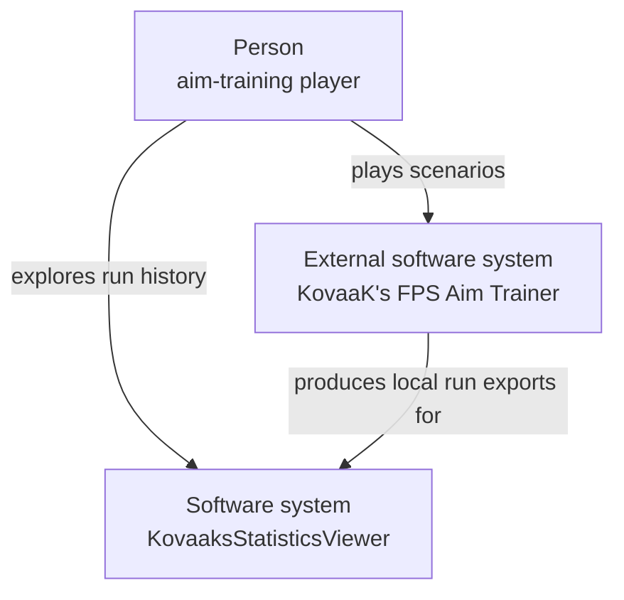
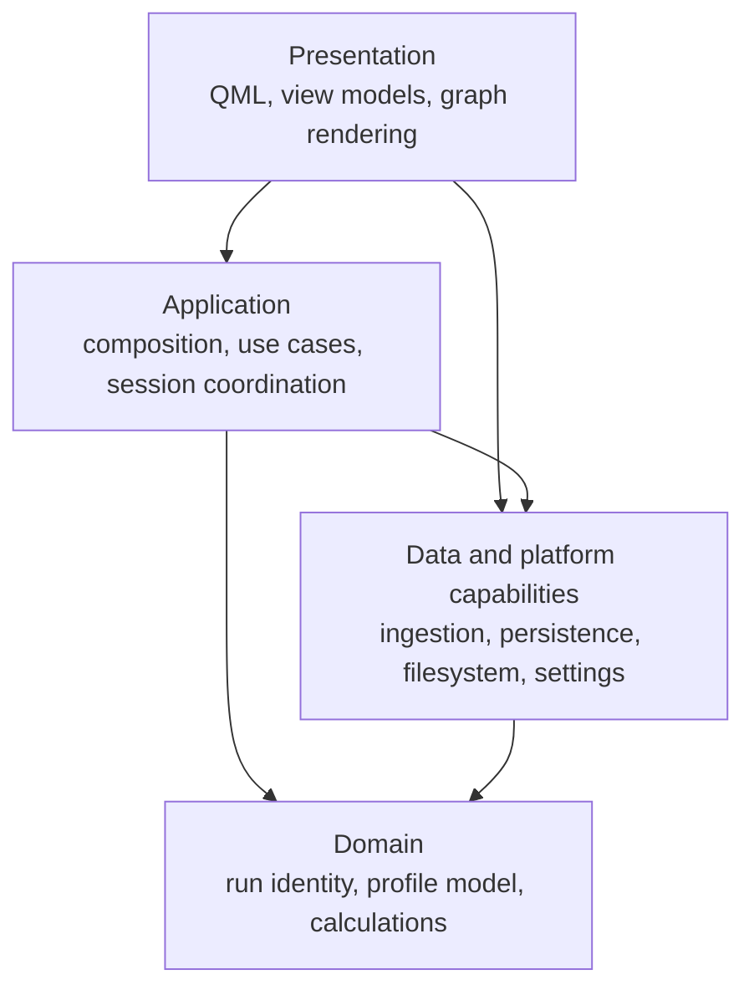
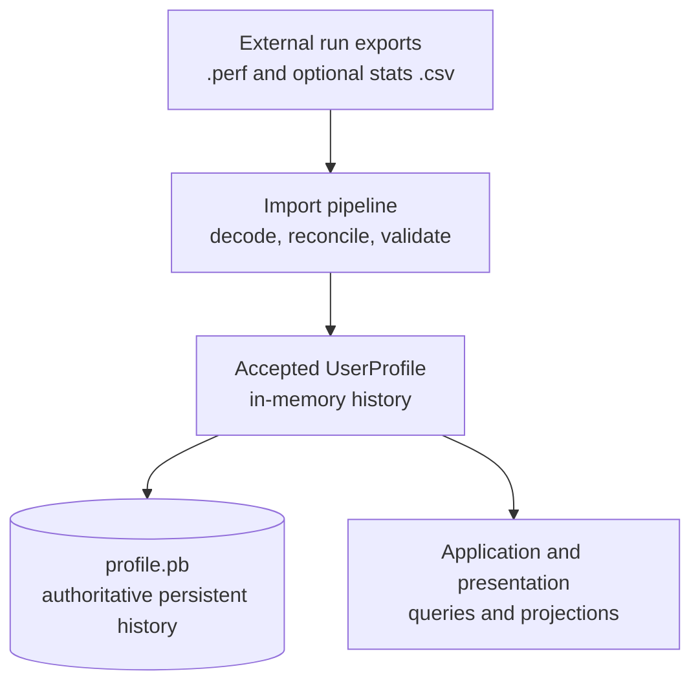

# KovaaksStatisticsViewer Architecture

This is the as-built Architecture Description for KovaaksStatisticsViewer (KSV). It describes the implemented system, not planned features or the historical rationale behind its design.

## Purpose, audience, and scope

KSV is a local desktop application that reads run data produced by KovaaK’s FPS Aim Trainer and presents scenario history, performance series, playtime, and configurable graph views.

This document is primarily for maintainers and contributors evaluating changes to runtime behavior, layer boundaries, persistence, data compatibility, UI integration, packaging, or testability.

The scope is the shipped `ksv` process and its local files. Development-only tests and the component gallery are included only where they explain architectural quality controls.

## System context

This view is for a maintainer orienting to the product. It answers: **who uses KSV, and which external software system supplies its data?** The takeaway is that the player uses both applications, while KovaaK's produces the local run exports that KSV imports.

**Type:** system context. **Scope:** the shipped KSV software system and its direct environment. **Concern:** people and external software-system interactions only.

**Key:** every box identifies its architectural type in the label. Each arrow names a distinct interaction; no internal KSV component, store, or technology is shown.

Evidence: [`src/main.cpp`](../../src/main.cpp), [`src/qt_data/file_service.cpp`](../../src/qt_data/file_service.cpp), [`src/data/profile_service.cpp`](../../src/data/profile_service.cpp), [`src/data/formats/protobuf/profile_serializer.cpp`](../../src/data/formats/protobuf/profile_serializer.cpp), [`src/qt_data/settings_service.cpp`](../../src/qt_data/settings_service.cpp), and [`src/ui/qml/VisualSettingsManager.qml`](../../src/ui/qml/VisualSettingsManager.qml).

KovaaK's produces `.perf` and optional stats `.csv` exports in configured local roots; KSV reads them as import inputs. KSV owns accepted run history in `profile.pb` and configuration in local settings. Qt, Protocol Buffers, files, and owned stores are internal or subordinate details rather than external software systems, so they are omitted from this context view. The verified production composition uses only local interactions; no remote service is present in this model.

## Architectural strategy and constraints

The logical request direction is:

`QML/UI → application use cases and controller → data services and Qt adapters → domain`

The implementation uses constructor injection and application-facing `I*` interfaces rather than a dependency-injection framework. [`App::App()`](../../src/app/app.cpp) is the single production composition root. It constructs concrete leaf services once, connects callbacks, and injects shared interface references into use cases and presentation view models.

The domain is ordinary C++ and owns run identity, profile indexing, and profile-level aggregates. Application use cases own graph-specific bucketing, expression evaluation, and series assembly. The domain has no Qt or I/O dependency.

Presentation code communicates with application behavior through interfaces and transport types. The `ksv_contracts` target contains the UI-facing use-case contracts and their data structures. Additional application-facing storage and service ports live under [`src/data/interfaces/`](../../src/data/interfaces/).

Observer mechanisms follow the component type boundaries. QObject-facing session and presentation paths use Qt signals, while non-QObject service and store interfaces register `std::function` callbacks for profile, settings, file, and series-configuration changes. The implementation establishes this split without recording a broader design rationale for it.

Because the composition root resides in `ksv_app`, that target physically links the UI and the concrete lower-layer libraries it assembles. The conceptual dependency rule is therefore enforced at injected component boundaries rather than by a strictly descending CMake graph.

The QML module is a static `NO_PLUGIN` module. Types that might otherwise be removed by the linker are explicitly referenced and registered by [`declare_metatypes()`](../../src/qml_registration.h) before any executable loads the module.

## Building blocks

### Responsibility model

This view is for a maintainer deciding where a change belongs. It answers: **which top-level responsibilities use which other capabilities?** The takeaway is that presentation delegates behavior to application and data capabilities, while application and data code operate over the domain model.

**Type:** top-level building-block dependency. **Scope:** major responsibilities inside the shipped process. **Concern:** principal capability dependencies, not target links, object ownership, or individual calls.

**Key:** boxes group responsibilities rather than enumerate classes or build targets. Every solid arrow points from a consumer to capabilities it uses; an unlabelled arrow always has that one meaning.

Evidence: [`src/app/app.cpp`](../../src/app/app.cpp), [`src/ui/qml/Main.qml`](../../src/ui/qml/Main.qml), [`src/ui/presentation/scenario_browser_vm.cpp`](../../src/ui/presentation/scenario_browser_vm.cpp), [`src/app/usecases/scenario_browser_use_case.h`](../../src/app/usecases/scenario_browser_use_case.h), [`src/app/session_controller.cpp`](../../src/app/session_controller.cpp), and [`src/data/profile_service.cpp`](../../src/data/profile_service.cpp).

Runtime requests move from QML through presentation adapters into application use cases, session coordination, and service/store ports. Reverse refresh paths use the observer mechanisms described under Architectural strategy and constraints. `App` constructs the production service, use-case, controller, and presentation graph and owns the QML engine; `SessionController` has the narrower responsibility for profile-build thread and worker lifetime. These implementation details remain in prose because they do not require separate root-level diagrams.

### Build target mapping

The build maps those responsibilities to static libraries. This inventory is a table because maintainers usually need an exact target-to-responsibility lookup, not a second dependency graph:

| Target | Responsibility and principal dependencies |
|---|---|
| `ksv_domain` | Qt-free run, source, and profile model. |
| `ksv_contracts` | Application-facing contracts and transport types over the domain. |
| `ksv_data` | Ingestion and authoritative profile persistence; uses Protocol Buffers, contracts, and domain. |
| `ksv_qt_data` | Qt-backed filesystem, settings, and series-configuration adapters. |
| `ksv_ui` | QML module, presentation models, axes, and custom graph rendering; consumes contracts. |
| `ksv_app` | Use cases, session coordination, background profile building, and production composition. |
| `ksv` | Process entry point and Qt event loop. |

See the root [`CMakeLists.txt`](../../CMakeLists.txt) and each target’s `CMakeLists.txt` under [`src/`](../../src/).

Six view models cross the C++/QML boundary as required initial properties: scenario graph, playtime, completion history, session/build state, settings, and scenario browser. [`Main.qml`](../../src/ui/qml/Main.qml) delegates interaction to them and composes the application’s panels.

The physical target graph is not identical to the logical dependency direction. In particular, `ksv_app` links `ksv_ui` because the `App` composition root constructs presentation objects; UI code still invokes application behavior through contracts.

### Accepted run-data authority

This view is for a maintainer changing ingestion or persistence. It answers: **where do external exports become accepted history, and what state drives persistence and presentation?** The takeaway is that imports are reconciled into the accepted in-memory profile, which is both persisted as the authoritative store and queried for presentation.

**Type:** data-flow diagram. **Scope:** external run exports through accepted history to persistence and presentation. **Concern:** run-data authority, not call direction or object ownership.

**Key:** the cylinder is KSV-owned persistent storage; the other boxes are data or processing roles. Every solid arrow means that run-history data is supplied to the next role or store. It does not identify the caller that initiates the transfer.

Evidence: [`src/qt_data/file_service.cpp`](../../src/qt_data/file_service.cpp), [`src/data/run_ingestor.cpp`](../../src/data/run_ingestor.cpp), [`src/data/profile_service.cpp`](../../src/data/profile_service.cpp), [`src/data/formats/protobuf/profile_serializer.cpp`](../../src/data/formats/protobuf/profile_serializer.cpp), [`src/app/usecases/scenario_browser_use_case.h`](../../src/app/usecases/scenario_browser_use_case.h), and [`src/ui/presentation/graph_vm.cpp`](../../src/ui/presentation/graph_vm.cpp).

The original exports remain external inputs and are not a recovery source after acceptance. `profile.pb` is the persistent authority, while the accepted in-memory profile supplies current application queries and presentation projections. [Profile lifecycle][profile-lifecycle] owns the detailed migration, quarantine, worker, and live-ingestion paths.

## Runtime behavior

### Profile establishment and ingestion

The authoritative run history is the profile store, `profile.pb`; the imported `.perf` and stats `.csv` files are inputs, not the history. At startup the composition root installs the build requester before the first load, so a missing or rejected store defers the first full build to the worker thread; a build request arriving while one is in flight is coalesced into a follow-up. Completed builds cross an acceptance boundary that discards candidates scanned under stale source roots and replays file arrivals that landed mid-build. Live ingestion watches the configured `FPSAimTrainer/performances` directories only and adds newly seen files, opportunistically enriched from already-present stats CSVs. Profile-path and source-directory settings follow two separate callback families: a path change reloads (or rebuilds into) the selected store, a directory change repoints only the watcher.

[Profile lifecycle][profile-lifecycle] owns the detailed account — load, migration, and quarantine outcomes; the worker handoff; the acceptance boundary; live ingestion; reconfiguration; shutdown; and recovery. Consult it before changing anything about how runs are built, accepted, saved, or switched.

Implementation anchors: [`src/app/session_controller.cpp`](../../src/app/session_controller.cpp), [`src/data/profile_service.cpp`](../../src/data/profile_service.cpp), and [`src/qt_data/file_service.cpp`](../../src/qt_data/file_service.cpp).

### Run selection and rendered graph

[Run selection and rendering details][run-selection-and-rendering] explains how a signal-only
`SelectionPanel.qml` carries primitive `(hash, startTimeMs)` values to `Main.qml`, where
`ScenarioBrowserViewModel` constructs the domain run identity and delegates selection to the session
controller. A successfully changed current run then fans out independently to the graph, scenario
browser, and—when the scenario hash changes—completion-history consumers; it is not returned through
the original QML call.

Consult this view before changing the QML/C++ transport, run identity, current-run notifications, or
graph refresh behavior. It also records that graph columns address stable `SeriesId::value` values and
that `GraphCanvas` is the presentation boundary rather than the owner of graph state.

## Data and persistence

### Identity and in-memory ownership

A `ScenarioId` is identified by its hash; its name is a display label and does not participate in equality or ordering. A run is identified by the combination of scenario hash and start time in `ScenarioRunId`.

`UserProfile` owns an append-only run vector and stable indexes by run ID and scenario ID. It also maintains per-scenario aggregates, total playtime, the latest run, and a registry that resolves compact source-file references back to configured roots and subdirectories.

Implementation anchors: [`src/domain/run.h`](../../src/domain/run.h), [`src/domain/user_profile.h`](../../src/domain/user_profile.h), and [`src/domain/source_directory.h`](../../src/domain/source_directory.h).

### Persistent stores

| Store | Owner | Content and behavior |
|---|---|---|
| `profile.pb` | `ProfileService` through `ProfileSerializer` | Authoritative run history, sources, totals, optional performance samples, and optional CSV-derived settings. The default path is `profile.pb` under Qt’s application-data location, and the user may configure another path. |
| Qt user settings | `SettingsService` | KovaaK’s source roots, profile path, serialized series configuration, and quarantined invalid series documents. |
| QML `Settings` | `VisualSettingsManager.qml` | Window dimensions, panel visibility, selected axes, and per-series visibility preferences. |
| KovaaK’s `.perf` and stats `.csv` files | External input, read by `FileService` and `RunIngestor` | Import sources. Once a run is in `profile.pb`, the serialized profile—not continued presence of the original files—is authoritative. |

`ProfileService` persists the accepted profile through `ProfileSerializer` after every accepted change, writing a temporary file and renaming it into place. Stores failing the header, version, or parse checks are quarantined beside the store rather than overwritten; the supported migration path is version 3 to 4. Switching the configured profile path reloads from that location — or rebuilds into it — and never copies the in-memory profile. [Profile lifecycle][profile-lifecycle] owns these mechanics in detail.

Series and axis configuration is a versioned JSON document stored through `QSettings`. `SeriesConfigStore` validates changes, migrates supported older document shapes, quarantines invalid content, and seeds defaults when recovery is required. Its draft mode keeps edits in memory until commit and can restore the pre-edit baseline on discard.

Implementation anchors: [`src/data/formats/protobuf/schema/profile.proto`](../../src/data/formats/protobuf/schema/profile.proto), [`src/data/formats/protobuf/profile_serializer.cpp`](../../src/data/formats/protobuf/profile_serializer.cpp), [`src/data/formats/protobuf/migration/profile_v3_migrator.cpp`](../../src/data/formats/protobuf/migration/profile_v3_migrator.cpp), [`src/qt_data/series_config_store.cpp`](../../src/qt_data/series_config_store.cpp), and [`src/ui/qml/VisualSettingsManager.qml`](../../src/ui/qml/VisualSettingsManager.qml).

## Build, deployment, and development topology

The application uses C++20, CMake, Ninja, Qt 6.11.1, MinGW, and vcpkg-provided Protocol Buffers. `scripts/toolchain.defaults.env` records the canonical Windows toolchain, while process environment values and the ignored `scripts/toolchain.local.env` provide controlled overrides.

The sanctioned Debug path is `uv run python scripts/build_and_test.py`. It configures and validates a repository-local `build-agent/` tree, fingerprints the resolved tools and runtime dependencies before incremental reuse, and retains full phase logs under `.temp/build-and-test/`. The runner consumes native stdout itself: success is summarized, while compiler, linker, GoogleTest, and QML failures are selected and printed without a separate log-read step. Focused logical scopes run the corresponding GoogleTest or Qt Quick Test executable with low-noise framework settings; the default path builds every target and runs the complete CTest suite. Builds are fixed at eight parallel compiler jobs. Protocol Buffer generation uses a build-local `protoc` runtime assembled from the resolved vcpkg and compiler installations, so configuring does not mutate the dependency installation.

The Release packaging script:

1. performs a clean Release configure and build by default;
2. runs `windeployqt` for Qt and QML dependencies;
3. copies vcpkg and compiler-matched MinGW runtime DLLs;
4. smoke-tests the packaged executable with toolchain paths removed from `PATH`; and
5. produces a self-contained `win64` ZIP.

The compiler-matched MinGW DLL copies are part of the deployment architecture: multiple installed MinGW runtimes can otherwise satisfy DLL lookup with ABI-incompatible files.

Tests mirror the production layers, with integration tests constructing the real object graph against fixture files. Qt Quick Tests cover QML behavior. The development-only gallery loads the real application wiring against disposable data and supports QML preview; it is excluded from Release builds.

Implementation anchors: [`CMakeLists.txt`](../../CMakeLists.txt), [`scripts/build_and_test.py`](../../scripts/build_and_test.py), [`scripts/toolchain.defaults.env`](../../scripts/toolchain.defaults.env), [`scripts/package-release.ps1`](../../scripts/package-release.ps1), [`tests/`](../../tests/), and [`tools/gallery/`](../../tools/gallery/).

## Cross-cutting quality responses

- **Responsiveness:** full profile reconstruction runs on a worker thread; progress is reduced to whole-percent changes before crossing threads.
- **Consistency during reconfiguration:** stale-root build results are rejected, concurrent file arrivals are queued, and repeated build requests are coalesced.
- **Persistence recoverability:** profile writes use temporary-file replacement; invalid profile and series stores are quarantined rather than silently reused.
- **Testability:** production leaves are injectable, use cases depend on interfaces, and integration tests can construct the real graph with deterministic paths.
- **UI decoupling:** QML interaction is signal-driven, while C++ view models expose Qt properties, models, and notifications.
- **Rendering performance and control:** graph lines and axes are painted by a custom C++ `QQuickPaintedItem` path while QML owns composition and interaction overlays.
- **Local data ownership:** run history and configuration remain in local profile and settings stores.

## Known risks and debt

- The KovaaK’s `.perf` schema contains fields whose meanings remain unknown or inferred. A producer-format change may require decoder and schema investigation.
- Live ingestion watches the performance directories, not the stats directories. CSV enrichment is opportunistic when the matching file exists at performance-file arrival; a later CSV-only arrival is incorporated on a subsequent full rebuild rather than through its own live notification.
- The supported profile migration path is specifically version 3 to version 4. Other incompatible versions are quarantined and rebuilt from configured sources where possible.
- The tracked toolchain defaults remain machine-specific Windows paths. Other environments must provide the same tools through process environment values or an ignored local override file; dependency versions are detected and fingerprinted rather than provisioned or pinned.
- Static QML type availability depends on maintaining the manual registration list in `declare_metatypes()`.
- Shutdown during an active full build waits for that build because the worker operation is not interruptible.

## Decision and design context

No Architecture Decision Records currently exist, so this description does not assign rationale to the observed structures.

<!-- arch-doc:references:start -->
[profile-lifecycle]: views/runtime/profile-lifecycle.md
[run-selection-and-rendering]: views/runtime/run-selection-and-rendering.md
<!-- arch-doc:references:end -->
