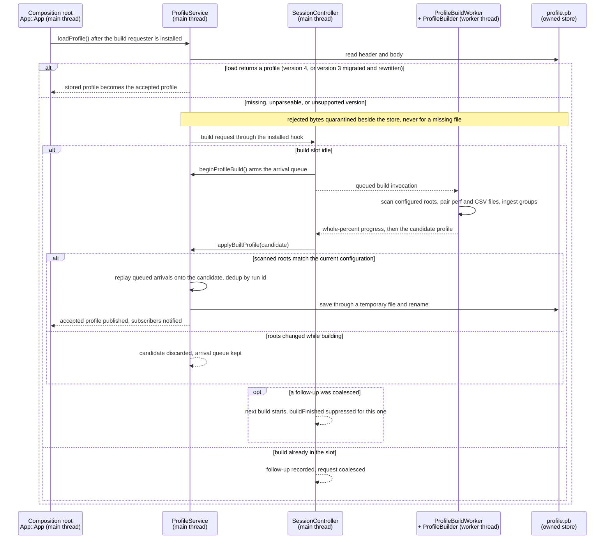
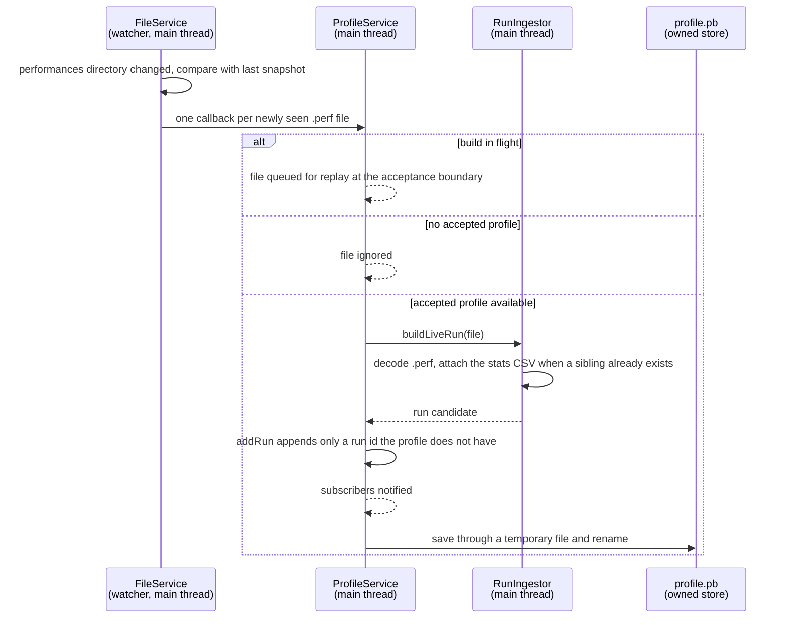
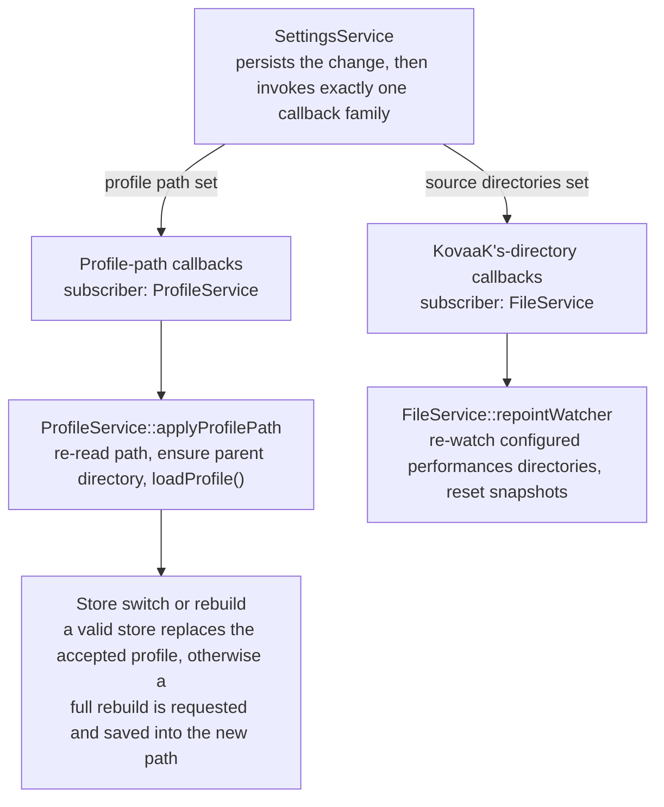

# Profile lifecycle

This view explains how KSV turns external KovaaK's files and a protobuf store into one accepted,
persisted run history: how the store is loaded, migrated, or replaced by a rebuild, how completed
builds and live file arrivals are admitted without committing obsolete state, how the profile path
and source directories are reconfigured, and what survives a failed save or an unparseable store.
It refines the root's runtime-behavior accounts for startup, profile establishment, live ingestion,
and profile persistence, and the building-block roles of `SessionController`, `ProfileBuildWorker`,
and `ProfileService` ([root](../../README.md)).

## Concern and scope

**Reader question:** how does KSV establish, accept, update, switch, and persist the authoritative
run history (`profile.pb`) without committing obsolete state?

The scope begins at startup composition, when [`App::App()`](../../../../src/app/app.cpp) installs
the build requester and calls `loadProfile()`, and covers settings-driven reconfiguration, worker
builds, live ingestion, the acceptance of build results, and persistence to `profile.pb`. It ends
where the accepted profile has been published to subscribers and saved (or the failure recorded).
Presentation reactions — current-run selection, graph and playtime refresh — are outside this view;
the root owns run selection and refresh, and this view only follows the notifications up to the
controller boundary. The series-configuration store, `.perf` decoding, and CSV parsing mechanics are
separate concerns.

Run identity is a root-level shared fact: a scenario is identified by its hash alone, a run by its
`ScenarioRunId` (scenario hash plus start time). Deduplication throughout this view keys on that run
identity.

## Participants and threads

| Element | Responsibility in this lifecycle | Thread execution |
|---|---|---|
| `ProfileService` ([src/data/profile_service.cpp](../../../../src/data/profile_service.cpp)) | Sole owner of the accepted in-memory `UserProfile` and of the store path; the only component that replaces or extends accepted history or persists it. | Main (event-loop) thread |
| `SessionController` ([src/app/session_controller.cpp](../../../../src/app/session_controller.cpp)) | Owns the build slot and the worker thread's lifetime; coalesces build requests; hands completed candidates to the acceptance boundary. | Main thread |
| `ProfileBuildWorker` / `ProfileBuilder` ([src/app/profile_build_worker.cpp](../../../../src/app/profile_build_worker.cpp), [src/data/profile_builder.cpp](../../../../src/data/profile_builder.cpp)) | Produce a candidate `UserProfile` by scanning configured roots, pairing `.perf` and stats `.csv` files, and ingesting each group. Never touch the accepted profile or the store. | Dedicated `QThread` during builds |
| `RunIngestor` ([src/data/run_ingestor.cpp](../../../../src/data/run_ingestor.cpp)) | Decodes files into domain runs and opportunistically attaches stats-CSV data; called by the builder on the worker thread and by `ProfileService` on the main thread. | Caller's thread |
| `FileService` ([src/qt_data/file_service.cpp](../../../../src/qt_data/file_service.cpp)) | Watches each configured `FPSAimTrainer/performances` directory, snapshot-diffs it, and reports additions; exposes the configured source roots. | Main thread |
| `ProfileSerializer` + `ProfileV3Migrator` ([src/data/formats/protobuf/profile_serializer.cpp](../../../../src/data/formats/protobuf/profile_serializer.cpp)) | Load, header/version check, version-3 migration, quarantine, and temporary-file-rename saves. | Main thread |
| `SettingsService` ([src/qt_data/settings_service.cpp](../../../../src/qt_data/settings_service.cpp)) | Persists the profile path and the KovaaK's source roots and invokes the corresponding callback family on change. | Main thread |
| `UserProfile` ([src/domain/user_profile.h](../../../../src/domain/user_profile.h)) | Qt-free accepted history: append-only run vector, `ScenarioRunId` deduplication, source registry. | Whatever thread owns it |

Thread execution is distinct from ownership: `SessionController` owns the worker thread and the
worker object's lifetime, while `ProfileService` alone owns the accepted profile and the store.

## Establishment: load, migrate, or rebuild

At startup the composition root constructs `ProfileService`, then `SessionController` — which
installs the build requester through `onBuildRequested` — and only then calls
[`loadProfile()`](../../../../src/app/app.cpp). This order is a recorded constraint: with the
requester already installed, a missing or rejected store defers the first build to the worker thread
instead of blocking startup for the length of a full directory scan
([src/app/app.cpp](../../../../src/app/app.cpp)).

`ProfileService::loadProfile()` asks `ProfileSerializer` to load the configured path. A successful
load — a current version-4 store, or a version-3 store migrated in place by `ProfileV3Migrator` and
rewritten — becomes the accepted profile and subscribers are notified. Every other outcome (file
missing, unparseable header or body, version other than 3 or 4, failed migration) requests a build
through the installed hook instead. A store that is present but rejected is quarantined first:
`ProfileSerializer` renames it in place beside the store with a reason, UTC timestamp, and content
digest suffix, so failed bytes are preserved rather than overwritten
([src/data/formats/protobuf/profile_serializer.cpp](../../../../src/data/formats/protobuf/profile_serializer.cpp)).
A missing file is not quarantined — there is nothing to preserve. When no requester is installed
(test and tooling contexts; production always installs one), `loadProfile()` falls back to a
synchronous build on the calling thread.

The build itself is an asynchronous handoff. `SessionController::startBuild()` rejects nothing but
coalesces: if a build already occupies the slot, the request is recorded as a follow-up and no second
worker invocation is queued. Otherwise it arms the arrival queue with `beginProfileBuild()` and
queues the worker invocation. On the worker thread, `ProfileBuildWorker` runs
`ProfileBuilder::build()` and emits progress reduced to whole-percent steps before crossing back.
The completed candidate returns through a queued signal to `onBuildFinished()`, which forwards it to
the acceptance boundary.

**Type:** sequence. **Scope:** startup establishment and one worker build through acceptance or
rejection. **Concern:** which component may publish a candidate, and what happens between building
and committing it.

**Participant key:** `ProfileService` owns the accepted profile and the store path; `SessionController`
owns the build slot and worker-thread lifetime; the worker object produces candidates on its own
thread; `profile.pb` is the KSV-owned store. Solid arrows are direct calls; dashed arrows are queued
signals or notifications across the thread or component boundary.

The load decision and the build pipeline produce only candidates. Nothing in this diagram publishes
history until `applyBuiltProfile()` accepts it; a candidate crossing the worker boundary is a value,
not a commitment.

## The acceptance boundary

[`ProfileService::applyBuiltProfile()`](../../../../src/data/profile_service.cpp) is the single gate
between a completed build and the accepted history. It performs three steps in order:

1. **Stale-root rejection.** The roots recorded in the candidate's source registry are compared with
   the currently configured roots (`FileService::sourceRoots()`, which reads live settings). A
   settings change can replace the configured roots while a build runs; a candidate scanned under
   different roots is discarded wholesale. The previously accepted profile stays in place, and the
   arrival queue is deliberately kept so the next accepted build can replay it.
2. **Replay of queued arrivals.** Files that arrived from the watcher while the build was in flight
   are ingested onto the candidate; runs whose `ScenarioRunId` the candidate already contains are
   skipped, because the scan may have seen the same files. The profile is published (and published
   again if replay changed it), then saved.
3. **Persistence.** `saveProfile()` writes the accepted profile; a failed save is logged and leaves
   the accepted in-memory profile unchanged.

Publication happens before persistence in both the acceptance and live paths: subscribers observe an
accepted change before the store is updated, and a failed save leaves the in-memory profile ahead of
the on-disk store. Nothing desynchronises silently — the save failure is logged — but visibility and
durability are distinct events at this boundary.

A rejected candidate schedules nothing. Arrivals queued during the rejected build remain queued and
reach the profile only when a later build is requested and accepted; files arriving after the
rejection are applied live against the still-accepted old profile.

Coalescing keeps the slot single: at most one follow-up is remembered, and when a follow-up restarts
after acceptance, `buildFinished` is suppressed for the superseded build, so presentation sees one
continuous build rather than two.

## Live ingestion of new runs

`FileService` watches each configured root's `FPSAimTrainer/performances` directory — the stats
directories are not watched. Each watched directory keeps a filename snapshot; on a directory
notification the snapshot is diffed and one callback per newly seen file reaches `ProfileService`.
Removed or modified files produce no notification, so accepted runs are never removed or rewritten by
watcher activity — the serialized profile, not continued presence of the source files, is
authoritative.

`ProfileService::addPerfFileToProfile()` queues the file while a build is in flight (replayed at the
acceptance boundary), ignores it while no profile is accepted, and otherwise ingests it immediately.
`RunIngestor::buildLiveRun()` decodes the `.perf` file and attaches the stats sibling's totals and
settings only when that CSV already exists — enrichment is opportunistic because nothing watches the
stats directories. A stats file that appears later is incorporated at the next full rebuild, where
the builder pairs all perf and CSV files. The same enrichment mechanism is reused by the version-3
migration, which resolves each stored run's perf source and re-reads its sibling CSV.

**Type:** sequence. **Scope:** one added `.perf` file from watcher notification to store or queue.
**Concern:** how a live arrival reaches the accepted profile without racing a build.

**Participant key:** the watcher and all handling run on the main thread; the store is the KSV-owned
`profile.pb`. Solid arrows are direct calls; dashed arrows are internal state transitions of
`ProfileService`.

Every ingestion path funnels through `UserProfile::addRun()`, which appends only a `ScenarioRunId`
the profile does not already hold. Duplicate protection therefore does not depend on which path
produced the run.

## Reconfiguration: profile path and source directories

`SettingsService` exposes two separate callback families — profile-path callbacks and
KovaaK's-directory callbacks — and each settings change invokes exactly one family. The families
share no subscribers and have different effects.

**Type:** flowchart. **Scope:** both settings callback families from persistence to their single
subscriber. **Concern:** keep the two reconfiguration paths and their effects separate.

**Key:** rectangles are components and callback steps; each arrow is the labelled change being
propagated. The directory family deliberately terminates at the watcher.

Switching the **profile save file** is a store switch, not a copy: `applyProfilePath()` re-reads the
path, ensures its parent directory exists, and re-runs `loadProfile()` against the new location. A
valid store there replaces the accepted profile; a missing or rejected one requests a rebuild, which
will be saved into the new path. The old in-memory profile is never written to the newly selected
file.

Reconfiguring the **source directories** repoints only the watcher: the accepted profile, the store,
and any in-flight build continue undisturbed. There is no automatic rebuild. The accepted history
evolves through live ingestion (which registers newly seen roots in the profile's source registry),
and a full rescan of the new roots happens on the next explicitly requested build — the settings
dialog's generate action reaches `SessionController::generateProfileFromDirectory()` — or on a later
store reload or process restart. A candidate that a directory change overtakes mid-build is discarded
by the stale-root check at the acceptance boundary.

## Shutdown

`SessionController`'s destructor quits and joins the worker thread
([src/app/session_controller.cpp](../../../../src/app/session_controller.cpp)). A build already
executing is not interruptible, so shutdown waits it out rather than tearing the thread down under
it. The completed candidate is delivered through a queued signal, and teardown does not process it:
the result of a build still running at shutdown is not applied or saved, and the on-disk store keeps
the last accepted save. (Delivery depends on Qt queued-signal semantics during destruction — a
bounded inference from the shutdown path, not an explicitly coded decision.)

## Consequences and invariants

- **Single publication authority.** Only `ProfileService` replaces or extends the accepted profile.
  The worker and builder produce candidates and cannot commit them; moving acceptance elsewhere would
  allow unvalidated or stale results to replace accepted history.
- **Built, accepted, and saved are distinct states.** A candidate crossing the worker boundary is not
  accepted; an accepted profile is visible to subscribers before the save completes; a failed save
  leaves the accepted profile ahead of the store with the failure logged.
- **Staleness is checked at acceptance, keyed on source roots.** Any mechanism that lets a build
  result bypass `applyBuiltProfile()` would reintroduce obsolete state.
- **Arrivals queue during builds and survive rejections.** Queued files are not applied until an
  accepted build replays them; after a rejection they wait for the next build rather than being
  applied or dropped.
- **Deduplication keys on `ScenarioRunId`.** Replay, live ingestion, rebuilds, and migration all
  funnel through `addRun()`, so re-ingesting the same run is always idempotent.
- **The store is authoritative; sources are not a recovery source.** Deleting or moving `.perf` and
  `.csv` files never removes accepted runs; recovery rebuilds only into an empty or rejected store,
  or when a rebuild is explicitly requested.
- **Rejection preserves evidence.** Quarantine renames (reason, timestamp, digest) keep failed bytes;
  saves use temporary-file replacement so a failed write cannot truncate the accepted store, and the
  rewritten store preserves its original header identity.
- **The two callback families stay separate.** A profile-path change reloads the store; a directory
  change repoints the watcher. Coupling either family to the other's effect would make reconfiguration
  order-dependent.
- **Shutdown is non-interruptible.** The worker slot must finish before the thread is destroyed;
  shutdown latency is bounded by the running build.

## Evidence and limitations

The verification scope covers [`src/app/app.cpp`](../../../../src/app/app.cpp),
[`src/app/session_controller.cpp`](../../../../src/app/session_controller.cpp) and its header,
[`src/app/profile_build_worker.cpp`](../../../../src/app/profile_build_worker.cpp),
[`src/data/profile_service.cpp`](../../../../src/data/profile_service.cpp) and its interface,
[`src/data/profile_builder.cpp`](../../../../src/data/profile_builder.cpp),
[`src/data/run_ingestor.cpp`](../../../../src/data/run_ingestor.cpp),
[`src/qt_data/file_service.cpp`](../../../../src/qt_data/file_service.cpp),
[`src/qt_data/settings_service.cpp`](../../../../src/qt_data/settings_service.cpp),
[`src/data/formats/protobuf/profile_serializer.cpp`](../../../../src/data/formats/protobuf/profile_serializer.cpp),
[`src/data/formats/protobuf/migration/profile_v3_migrator.cpp`](../../../../src/data/formats/protobuf/migration/profile_v3_migrator.cpp),
[`src/domain/user_profile.cpp`](../../../../src/domain/user_profile.cpp), and the settings
view-model and QML call sites for reconfiguration. Subscriber wiring was checked by search, not
exhaustively.

Limitations and boundaries:

- The shutdown claim (a mid-build result is not applied) is a bounded inference from queued-signal
  delivery during teardown; the code records the wait, not the discard.
- No latency or throughput claims are made; whole-percent progress is a mechanism, not a measured
  outcome.
- Durability beyond temporary-file-then-rename (for example OS-level flush guarantees) is not
  established.
- Watcher edge cases — notifications missed while re-watching, directories that fail to open, very
  large arrival bursts — were not exercised; the pending-arrival queue is unbounded and undeduplicated
  until replay.
- `SettingsService` guards its store with a mutex, but a thread-level audit of every settings caller
  was out of scope.
