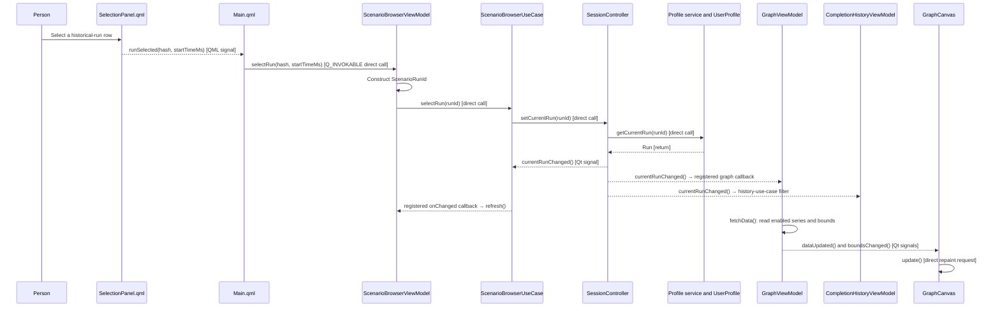

# Run selection and rendering

## Concern and scope

How does selecting an already recorded run cross the QML/C++ boundary, establish the process's current run, and independently refresh the browser, scenario-history, and rendered performance graph? This account begins when a person selects a row in `SelectionPanel.qml` and ends when the graph presentation boundary has requested a repaint. It refines the root's runtime-selection summary.

The concern includes the primitive QML transport, `ScenarioRunId` identity and resolution, the current-run notification, and its consumer-specific refresh paths. It excludes expression-DSL authoring, series persistence, and `QPainter`/axis/line-painter implementation details.

## Boundary and participants

`SelectionPanel.qml` is a signal-only interaction component: it has models and simple display state, but no view-model property. Both its scenario-run list and its cross-scenario recent-run list emit `runSelected(string hash, double startTimeMs)`. `Main.qml` owns the boundary wiring and directly invokes `ScenarioBrowserViewModel::selectRun(hash, startTimeMs)`. QML therefore transports a string and a number, never a `domain::ScenarioId`, `domain::ScenarioRunId`, or `domain::Run`. [`src/ui/qml/SelectionPanel.qml`](../../../src/ui/qml/SelectionPanel.qml) and [`src/ui/qml/Main.qml`](../../../src/ui/qml/Main.qml).

`ScenarioBrowserViewModel::selectRun` is the QML-visible `Q_INVOKABLE` transport adapter. It combines the selected hash and millisecond timestamp with its active scenario display name to construct `domain::ScenarioRunId`, then directly calls `IScenarioBrowserUseCase::selectRun`. [`src/ui/presentation/scenario_browser_vm.h`](../../../src/ui/presentation/scenario_browser_vm.h) and [`src/ui/presentation/scenario_browser_vm.cpp`](../../../src/ui/presentation/scenario_browser_vm.cpp).

The display name is not part of identity: `ScenarioId` equality, ordering, and hashing use its hash only. `ScenarioRunId` equality and hashing add `start_time`; consequently a recent-run selection remains resolvable even if the view model's active scenario name is only a display label. [`src/domain/run.h`](../../../src/domain/run.h).

| Participant                            | Responsibility in this flow                                                                                                                                                   |
| -------------------------------------- | ----------------------------------------------------------------------------------------------------------------------------------------------------------------------------- |
| `ScenarioBrowserUseCase`             | Delegates a selected `ScenarioRunId` to the injected `ISessionController`; observes current-run and profile notifications, then invokes its registered browser callbacks. |
| `SessionController`                  | Resolves a requested ID through `IProfileService`; changes `m_current_run` and emits `currentRunChanged` only when the resolved run's ID differs.                       |
| `UserProfile`                        | Uses its run-ID index to return the resolved run, or no value for an unknown key.                                                                                             |
| `App`                                | Composes the use cases and registers the independent graph and history callbacks.                                                                                             |
| `GraphViewModel` and `GraphCanvas` | Adapt the selected run to series and axes, then bridge presentation notifications to an update request.                                                                       |

`ScenarioBrowserUseCase::selectRun` is a direct one-hop delegate. `SessionController::setCurrentRun(ScenarioRunId)` first asks the profile service for the run; that service delegates to `UserProfile`'s run-ID index. An unknown ID leaves the current run unchanged. The overload accepting a resolved `Run` suppresses `currentRunChanged` when its ID is already current. [`src/app/usecases/scenario_browser_use_case.h`](../../../src/app/usecases/scenario_browser_use_case.h), [`src/app/session_controller.cpp`](../../../src/app/session_controller.cpp), [`src/data/profile_service.cpp`](../../../src/data/profile_service.cpp), and [`src/domain/user_profile.cpp`](../../../src/domain/user_profile.cpp).

## Selected-run sequence

**Type:** focused runtime sequence. **Scope:** a selection that resolves to a different historical run. **Concern:** distinguish direct calls from the Qt signal and callback fan-out that follows publication of the new current run.

**Arrow key:** solid arrows are direct calls or returns. Dashed arrows are named QML/Qt signals or registered callbacks; they do not imply a return path to the initiating QML call. The model omits the unchanged-ID and unresolved-ID alternatives: both avoid `currentRunChanged`, so this fan-out does not run.

The `App` composition root registers the graph callback through `GraphUseCase::onCurrentPerfChanged`, which connects it to `ISessionController::currentRunChanged`; the callback calls `GraphViewModel::fetchData`. Separately, `ScenarioBrowserUseCase` connects to the same session signal, calls its `std::function` subscribers, and the browser view model refreshes its current-run identity, scenario list, active-scenario run list, and recent-runs list. [`src/app/app.cpp`](../../../src/app/app.cpp), [`src/app/usecases/graph_use_case.h`](../../../src/app/usecases/graph_use_case.h), [`src/app/usecases/scenario_browser_use_case.h`](../../../src/app/usecases/scenario_browser_use_case.h), and [`src/ui/presentation/scenario_browser_vm.cpp`](../../../src/ui/presentation/scenario_browser_vm.cpp).

The history path is intentionally narrower. `CompletionHistoryUseCase` listens to the same signal but calls its callback only if the selected scenario hash changed; the callback registered in `App` refreshes `CompletionHistoryViewModel`. Selecting a different run of the same scenario updates the current graph and browser selection without rebuilding that scenario's completion history. [`src/app/usecases/completion_history_use_case.h`](../../../src/app/usecases/completion_history_use_case.h) and [`src/app/app.cpp`](../../../src/app/app.cpp).

## Graph adaptation and presentation boundary

`GraphViewModel::fetchData` obtains the enabled series configurations and resolves values for each series against the controller's current run. It updates title, points, content state, and time bounds, then emits `dataUpdated` and (when changed) `boundsChanged`. It assigns each `SeriesModel`'s `id` from `SeriesId::value` and its `column` from that same ID, while retaining a map keyed by ID. [`src/ui/presentation/graph_vm.cpp`](../../../src/ui/presentation/graph_vm.cpp), [`src/ui/presentation/graph_vm.h`](../../../src/ui/presentation/graph_vm.h), [`src/app/usecases/graph_use_case.h`](../../../src/app/usecases/graph_use_case.h), and [`src/app/contracts/series_config.h`](../../../src/app/contracts/series_config.h).

Dashboard QML derives visible columns through `columnForSeriesId` and maps the chosen axis series back with `seriesIdForColumn`; it does not use a row or list position as a series address. The preservation rule is that a graph column denotes the stable series ID value, so adding, disabling, or reordering configured series must not retarget a visible line or selected axis. [`src/ui/qml/DashboardGraphCanvas.qml`](../../../src/ui/qml/DashboardGraphCanvas.qml) and [`src/ui/presentation/graph_vm.cpp`](../../../src/ui/presentation/graph_vm.cpp).

`GraphCanvas` is the presentation boundary. It observes `GraphViewModelBase::dataUpdated` and `boundsChanged`, recalculates its exposed plot area as needed, and calls `update()`. The canvas later requests the series and axes it needs from the view-model interface; drawing mechanics remain outside this view. `DashboardGraphCanvas.qml` instantiates the canvas only for `GraphViewModel::HasData`, otherwise presenting the selected-run state message. [`src/ui/components/graph_canvas.cpp`](../../../src/ui/components/graph_canvas.cpp) and [`src/ui/qml/DashboardGraphCanvas.qml`](../../../src/ui/qml/DashboardGraphCanvas.qml).

## Consequences and invariants

- Keep `SelectionPanel.qml` signal-only. Moving a C++ view-model reference into it would duplicate the boundary that `Main.qml` currently owns.
- Preserve the primitive `(hash, startTimeMs)` QML contract and its sole translation in `ScenarioBrowserViewModel`; QML must not be made responsible for constructing or carrying domain identity objects.
- Treat `SessionController`'s successfully changed current run as the publication point. Consumer refreshes are independent subscriptions, not a synchronous response chain through the original selection request.
- Keep graph columns keyed by `SeriesId::value`, not enabled-series order or display position.
- Preserve the narrower history subscription: it is intentionally scenario-hash-sensitive, whereas graph and browser refresh for every changed current run.

## Evidence and limitations

The verification scope covers the current QML signal wiring; `ScenarioBrowserViewModel`, use-case, controller, profile-resolution, and identity implementations; and the production callback registrations through the graph, browser, history, and canvas boundaries. The codebase graph was indexed at generation `2026-09-06T05:41:34Z`; coverage metadata marks several headers partially parsed and all selected paths metadata-changed, so the relevant headers and implementation files were read directly. This establishes the implemented in-process flow, but not a timing or thread-scheduling guarantee. It also does not cover expression authoring, series-store lifecycle, or painter internals, by design.
