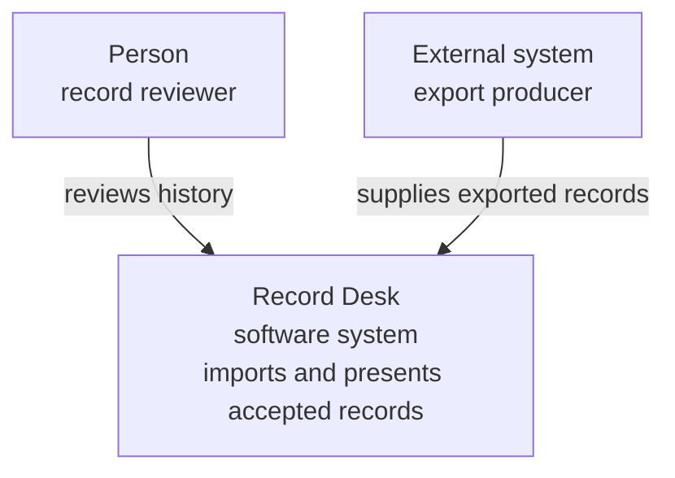
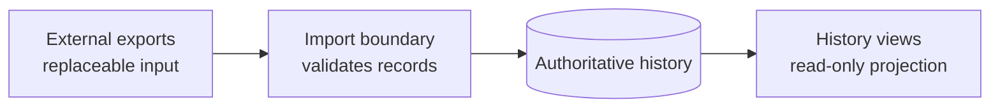
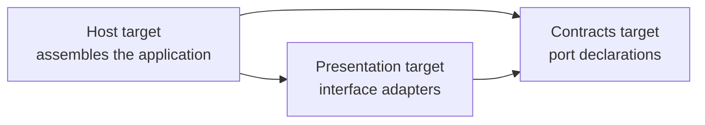
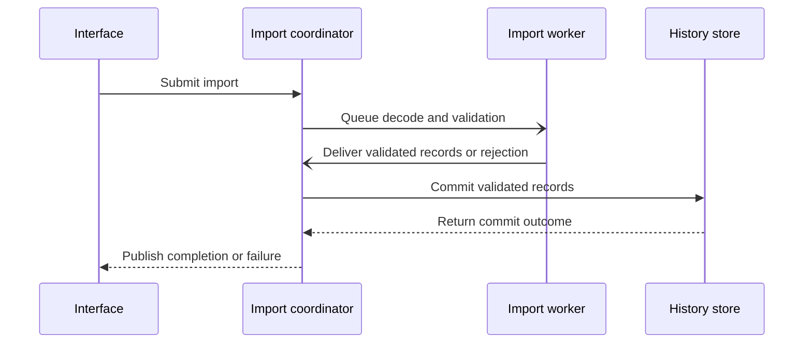

# Diagram Style

Diagrams support the account in a root or view. Apply the [global evidence, significance, and consistency rules](../README.md); a visual model is as factual as its surrounding prose. Accuracy is necessary but not sufficient: a diagram must also earn its place and remain comprehensible where the documentation renders it.

## Three quality gates

A diagram must pass three gates in order. Do not repair a failure at an earlier gate with more notation at a later one.

### 1. Admission

Before drawing, write:

1. the intended reader;
2. the architectural question that reader needs answered;
3. the one-sentence takeaway the diagram should make apparent.

Include a diagram only when it answers that question faster or more reliably than prose or a table. A relationship-rich structure, boundary, runtime interaction, state transition, deployment topology, or data lifecycle is a likely candidate. An inventory, a list of facts, or a relationship that reads more clearly as a short sentence or table is not.

The introduction immediately before the diagram must state its type, scope, and principal concern and must make the intended question or takeaway clear. It may use a sentence or compact table rather than literal labels:

> **Type:** sequence. **Scope:** one background import from request to publication. **Concern:** only the coordinator can commit a worker result.

### 2. Semantic integrity

Every admitted diagram must:

- Communicate one principal architectural message at one primary abstraction level.
- Give elements meaningful names, types or roles, and understandable responsibilities. Use adjacent prose or a compact participant key rather than overloading boxes.
- Show relationship direction consistently with its declared meaning.
- Identify a protocol, mechanism, or technology only when it explains an architectural boundary or constraint.
- Mark people and external systems as boundary context and preserve canonical element names and relationship meanings.
- Explain every non-obvious shape, colour, size, border, arrowhead, and line style.
- Agree with the narrative and its evidence.

Explain abbreviations on first use. Do not add technology names as decorative detail.

### 3. Rendered comprehension

Render every diagram and inspect it at the normal documentation width without zooming. It must have:

- a clear first reading path that agrees with the surrounding narrative;
- readable node and edge text;
- visually apparent grouping;
- few crossings and little backtracking;
- no large empty detours or compressed clusters caused by layout;
- a takeaway that does not require decoding every element.

Changing Mermaid's layout direction or layout algorithm can improve placement, but it cannot repair an over-scoped model. If no renderer is available, disclose that limitation and do not claim that rendered readability was verified.

## Selecting an abstraction

Choose the model by reader question, then include the smallest set of elements needed to answer it.

| Reader question | Model | Abstraction boundary |
|---|---|---|
| Who uses the system, and which software systems are outside it? | System context | Treat the documented system as one black box. Show people and external software systems, not its internal technology or structure. |
| Which major responsibilities depend on which others? | Building-block or dependency view | Prefer layers, subsystems, and responsibility-bearing components. Refine only the few blocks whose internals matter to the question. |
| Who acts, and what architecturally significant ordering or handoff occurs? | Sequence or focused runtime flow | Show one representative scenario and only interactions that reveal responsibility, ordering, concurrency, consistency, or failure containment. |
| Which states and transitions have architectural consequences? | State or lifecycle view | Show significant states, triggers, guards, and terminal outcomes rather than implementation control flow. |
| How does authoritative or transformed data move? | Data-flow view | Show authority, transformation, and movement at one level; omit complete schemas and field mappings. |
| Where does execution occur? | Deployment view | Show execution environments, deployable units, material infrastructure dependencies, and trust or network boundaries. |

A system context excludes internal libraries, frameworks, storage mechanisms, protocols, processes, threads, components, and deployment units unless one is genuinely an external software system. Move storage ownership, internal technology choices, and component structure to focused lower-level views.

A building-block or dependency view is not an exhaustive module, target, file, class, or adapter inventory. When internal structure matters, create a child refinement that names the parent element it expands and preserves the parent's external relationships. Do not mix parent and child abstraction levels in one model.

A runtime view is representative and schematic. Omit routine calls, plumbing, and branches that merely reproduce implementation control flow. Split architecturally different paths into separate scenarios instead of nesting every alternative into one sequence.

A deployment view excludes build-time dependencies and ordinary in-process object structure. A data-flow view does not mix system-level movement with complete schemas or field-level transformations.

Raise the abstraction or split the diagram when:

- its concern joins separate reader questions, often signalled by an “and” in the intended takeaway;
- a context view contains implementation technology;
- a dependency view enumerates everything that could be drawn;
- a runtime view reproduces routine branching and error handling;
- unrelated elements need prose explaining why they share a diagram.

## Relationship grammar

A diagram may declare the meaning of a repeated relationship once in its introduction, caption, or key. Within that diagram, every edge with the same visual format must then have that same meaning. For example, a build view can declare that every unlabelled solid arrow points from a linking target to its dependency.

Use this order of preference:

1. Declare one uniform relationship meaning once and leave its repeated edges unlabelled.
2. Label an individual edge when its specific action, payload, protocol, condition, cardinality, timing, or exception matters to the takeaway or would otherwise be ambiguous.
3. Give a necessary second relationship family a distinct line style and explain it in the key as well as with any useful label.
4. Split the diagram when comparing relationship families is not its principal message.

If removing an edge label changes neither the reader's answer nor the interpretation of the edge, remove it. Repeating “links to”, “depends on”, or another identical phrase on every edge is visual noise once the relationship has been declared.

A compile-time dependency, runtime call, data movement, and ownership relationship answer different questions. Do not distinguish them by colour or dashed lines alone. Direction remains semantic: a call arrow points from caller to callee even when returned data travels back, while a data-flow arrow points from producer to recipient. Sequence arrows must distinguish direct calls, queued handoffs, and responses when synchrony is architecturally significant.

The default grammar for flowcharts is:

- an unlabelled solid directed edge carries the principal relationship declared for that diagram;
- a differently styled edge is a secondary or exceptional relationship and must be labelled when its meaning is not immediately evident and explained in the key;
- one visual edge style never changes meaning within the same diagram.

This is a semantic default, not a required colour palette. Mermaid themes and other maintainable notations may render it differently.

## Complexity, layout, and explanation

Node and edge counts are review prompts, not universal pass/fail limits. Model complexity depends on the reader, concern, notation, and layout. Raise the abstraction, split the model, or replace it with prose or a table when:

- readers must trace many crossings to answer the stated question;
- most edges need distinct prose labels;
- the principal message needs more than roughly one paragraph or five short bullets to explain;
- the same node appears only to connect otherwise unrelated concerns;
- the legend becomes a catalogue rather than a small visual key;
- normal-width rendering requires zoom or horizontal scrolling;
- removing detail would change the model into a different architectural question.

The paragraph-or-five-bullets measure is a practical warning from technical-illustration guidance, not a scientific maximum. Its purpose is to trigger editorial judgment before a diagram becomes a compressed specification.

Choose left-to-right or top-to-bottom layout to follow the dominant narrative. Use placement and grouping to make semantic clusters perceptible. Split a crowded model into an overview and focused refinements rather than forcing the renderer to arrange excessive detail.

Follow each diagram with its significant conclusion. Explain surprising arrows, exceptions, omissions, and invariants; do not narrate every obvious box and line.

## Accessibility

Every Mermaid diagram must provide a concise `accTitle` and `accDescr`. The title identifies the model; the description states its purpose and essential relationship rather than transcribing every node. Adjacent prose must preserve the architectural takeaway when the image or Mermaid rendering is unavailable.

Colour may reinforce meaning but cannot be its sole carrier. Pair it with a label, line style, border, shape, or other non-colour cue and explain the cue. Avoid decorative variation that suggests distinctions the model does not define.

## Context example

Record Desk is fictional. The intended reader is a maintainer orienting to the product. The question is who uses Record Desk and which software system supplies its input. The takeaway is that a reviewer uses Record Desk as one system, which imports records produced by an external exporter.

**Type:** system context. **Scope:** Record Desk and its environment. **Concern:** people and external software systems that interact with the product.

**Key:** each box states whether it represents a person or software system. Labels are retained because the two edges describe different interactions. The internal storage, framework, and import components are deliberately absent.

Record Desk is the system under description and remains a black box here. Its accepted-history authority is important but answers a lower-level question, so it belongs in a focused refinement.

## Focused data-authority example

The intended reader is a maintainer changing persistence behavior. The question is where imported records cease to be replaceable input and become authoritative history. The takeaway is that data moves from external exports through the import boundary into the authoritative history store and then into read-only views.

**Type:** focused data-flow refinement. **Scope:** record data from import to display. **Concern:** authority over accepted history.

**Key:** every unlabelled solid arrow means “supplies record data to”; the cylinder marks the authoritative persistent store. The element labels distinguish replaceable input, authority, and projection without changing the edge meaning.

This view has only one more element than the context example, but it is separate because it answers a different reader question at a lower abstraction level. External exports are not a recovery source after the history store accepts a record.

## Build-dependency example

The intended reader is a maintainer changing target boundaries. The question is which selected targets link which others. The takeaway is that the host links both presentation and contracts, while presentation links contracts directly.

**Type:** build dependency diagram. **Scope:** selected fictional application targets. **Concern:** link dependencies.

**Key:** boxes are build targets. Every unlabelled solid arrow means “links to” and points from the linking target to its dependency. This is not an execution sequence.

Repeating “links to” three times would add ink without adding meaning. If generated-code production or another relationship became important, it would need a distinct keyed style or, when not central to this question, a separate diagram.

## Worker-runtime example

The intended reader is a maintainer changing background import. The question is who may turn a worker result into accepted history. The takeaway is that the worker computes a candidate result, but only the coordinator asks the store to commit it.

**Type:** sequence. **Scope:** one import request through publication outcome. **Concern:** commit authority across an asynchronous worker handoff.

**Participant key:** the interface collects requests and displays status; the coordinator owns the request and publication decision; the worker computes a result away from the interface thread; the store persists accepted history. Solid arrows with filled heads are direct calls; solid arrows with open heads are asynchronous worker handoffs; dashed arrows with filled heads return outcomes. Each visual format has one meaning in this sequence.

The sequence stops at the architecturally significant publication outcome. Retry policy, validation branches, cancellation, and power-loss recovery are omitted because they do not answer this view's question. If one of those paths has distinct architectural consequences, give it a separate scenario.

## Weak mixed-concern example

An “application overview” that puts the user, UI classes, build targets, a worker thread, protobuf files, and the persistent store in one graph does not become focused merely because its caption states one concern. It mixes context, build, runtime, data, and implementation questions at incompatible abstraction levels. Split it by reader question and omit details that do not affect each answer.

## Local review

**Must:** The diagram passes admission, semantic-integrity, and rendered-comprehension gates. Its intended reader, architectural question, takeaway, type, scope, abstraction, notation, and relationship directions are unambiguous. A repeated edge style has one declared meaning; distinct meanings are labelled or keyed without relying on colour alone. Refinements preserve their mappings. Mermaid includes `accTitle` and `accDescr`, and adjacent prose preserves the takeaway. A deliberately weak teaching example is labelled and immediately explained.

**Should:** Typography, spacing, and minor aesthetic choices support the reading order. Prefer a compact key and restrained visual styling.

Finally ask: **Would deleting this diagram make the intended architectural answer materially harder to obtain?** If not, remove it or replace it with prose or a table.
