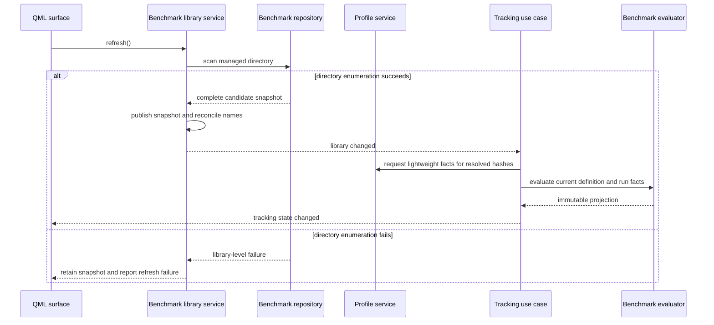

# Scenario benchmark tracking design

## Purpose and design scope

This document proposes the technical design for [Scenario benchmark tracking](requirements.md). It decides how benchmark definitions are represented and persisted, how the application reconciles name-based membership with hash-based run identity, how benchmark projections are derived from the authoritative profile, and how management and tracking fit into the existing Qt/QML application.

The design does not define implementation tasks, publish a third-party benchmark schema, retain historical definition versions, or change the authority of `profile.pb`. It also does not introduce a benchmark rank derived from recent performance; recent averages remain scenario-level context.

## Design basis

The current application has no benchmark model, managed benchmark store, benchmark use case, or benchmark presentation surface. The relevant implemented baseline is:

- `UserProfile` is the Qt-free owner of accepted run history. It indexes runs by `ScenarioRunId`, groups them by the hash-identified `ScenarioId`, and exposes chronological per-scenario history, personal-best inputs, total time, and rolling playtime.
- `ProfileService` is the sole owner of the accepted in-memory profile and publishes profile changes through `IProfileService`. Imported source files are inputs; the serialized profile remains authoritative after acceptance.
- Application use cases read `IProfileService` and expose presentation contracts. View models adapt those contracts for QML, while `App::App()` constructs the concrete graph and registers refresh callbacks.
- `SeriesConfigStore` provides an existing precedent for versioned JSON validation and an explicit draft lifecycle, although its document is stored in `QSettings` rather than as independently managed files.
- `Main.qml` is a single resizable desktop window using dark Fusion controls, with required C++ view-model properties supplied by `App::start()`. `SettingsDialog` establishes the window-modal, single-draft Save/Discard/Cancel convention.

The repository's [Architecture Description](../../architecture/README.md), [profile lifecycle view](../../architecture/views/runtime/profile-lifecycle.md), and [run-selection and rendering view](../../architecture/views/runtime/run-selection-and-rendering.md) were used to preserve the existing ownership, layering, composition, and notification boundaries. No accepted ADR currently governs benchmark persistence or identity.

The requirements document remains marked `proposed`; this design is therefore also a proposal. The codebase graph used for discovery was current to its recorded generation, but it reported metadata changes and partial parsing in several relevant headers. Material declarations and implementations were read directly. No benchmark-scale latency measurements or established generic managed-file repository abstraction exist, so the initial synchronous evaluation choice is a bounded performance assumption rather than a measured conclusion.

## Technical drivers

The design is shaped by these concerns:

- Benchmark definitions are KSV-owned, human-readable, independently versioned files, while run history remains exclusively owned by the profile.
- A directory may contain valid, incomplete, invalid, unsupported, externally modified, or deleted files at the same time. One problem must not disable the rest of the library or leave stale results visible.
- Playlist membership arrives as names, while accepted run identity is hash-based. Automatic resolution must not guess among multiple hashes or overwrite a saved mapping.
- Definitions are editable and incomplete work is valuable. Validation must preserve repairable drafts without allowing partial thresholds to produce plausible but misleading ranks.
- Every benchmark projection is retrospective under the current definition. Persisting derived ranks would create stale or historically inconsistent results.
- Large playlists make hierarchy editing and threshold entry dense, while tracking needs enough space for status, two histories, and scenario-level blockers.
- Rank, category, validation, and matching state must remain understandable without relying on configurable colors.

## Proposed design and delta

The feature adds a benchmark capability spanning the existing layers:

`QML presentation -> benchmark application services and use cases -> benchmark repository and profile ports -> benchmark domain`

The domain gains immutable identities, definition structures, validation results, and a pure evaluator. A filesystem-backed repository in the Qt data layer owns the managed benchmark directory and playlist decoding. An application-level library service owns the accepted in-memory benchmark snapshot and its single active draft. A tracking use case joins an accepted definition with lightweight facts obtained through `IProfileService`, invokes the evaluator, and publishes a cached projection. Two presentation view models expose management and tracking state to separate QML surfaces.

Definitions and their file diagnostics are loaded at startup. The benchmark library subscribes before the initial profile load so that either a stored profile or a later asynchronous build can trigger scenario reconciliation. The existing requirement that `SessionController` install the profile-build requester before `loadProfile()` remains unchanged.

The main window becomes a visible two-workspace shell: **Scenarios** retains the existing dashboard, and **Benchmarks** hosts tracking. Management opens from the benchmark workspace or application menu in a resizable window-modal dialog that follows `SettingsDialog` rather than replacing the main workspace.

## Design elements and responsibilities

### Benchmark model

The Qt-free benchmark model owns the current editable meaning of one benchmark:

- `BenchmarkId`, `TierId`, `GroupId`, and `ScenarioEntryId` are immutable opaque UUID values.
- A benchmark has a non-empty display name when complete, an ordered tier ladder, one fixed neutral Uncategorized collection, and ordered user-created categories. Uncategorized has no editable category identity or color.
- A tier has a stable ID, editable name, and platform-neutral RGBA color value.
- A scenario entry has a stable ID, retained display name, optional persisted scenario hash, and exactly one threshold associated with every tier ID when complete.
- A category contains either scenario entries directly or subcategories. A subcategory contains scenario entries. The model permits incomplete editing states but never deeper nesting.
- Each scenario entry appears exactly once in the hierarchy. A persisted hash is a mapping, not a replacement for the retained display name.

Stable IDs separate identity from display order and editable names. Thresholds reference tier IDs rather than array positions, so reordering a tier cannot silently retarget scores. JSON remains structurally nested for readability; IDs support reliable mutations, validation locations, and QML model keys.

### Benchmark validator

The validator is pure domain behavior and returns all known issues in one pass. Each issue has a stable code and the closest available benchmark, tier, group, or scenario-entry ID; the user-facing message is derived in presentation, matching the existing `ValidationError` convention. It classifies a successfully decoded definition as either **Incomplete** or **Trackable**.

Incomplete conditions include the product-level setup and consistency rules: missing names, scenarios, or tiers; duplicate tier names or scenario membership; missing, duplicate, non-finite, negative, or non-increasing thresholds; empty user-created groups; mixed direct scenarios and subcategories; and multiple entries resolving to the same hash. Uncategorized may be empty. Unresolved, ambiguous, and mapped-but-unavailable scenarios do not make a structurally complete benchmark incomplete; they remain unplayed inputs to tracking.

Unsafe representation failures are rejected before domain validation and reported as **Invalid**. Examples include malformed JSON, wrong field types, duplicate stable IDs, dangling tier references, or an unsupported structural shape. A readable version newer than the application supports is **Unsupported** rather than invalid.

### Benchmark evaluator

The evaluator is a deterministic, Qt-free function of a loaded definition, its completeness result, and chronological run facts for its unique resolved hashes. It produces a `BenchmarkProjection` containing:

- current personal best, recent average and sample count, attained tier, next threshold, matching state, and blocking state for every scenario;
- satisfaction state for categories and subcategories;
- optional official attained rank, highest completed rank, partial counts, and next-tier blockers;
- optional current continuous average rank and its personal-best history;
- total benchmark playtime and the three-day rolling-playtime series.

Scenario history, matching state, recent averages, personal bests, and playtime remain available when the definition is incomplete wherever they can be interpreted safely. Official rank, completion, blockers, and average-rank outputs are absent unless completeness validation is `Trackable`. The evaluator never reads files, subscribes to changes, resolves names, mutates a definition, or persists its output.

### Benchmark repository

`IBenchmarkRepository` is the application-facing persistence port. Its Qt-backed implementation owns the fixed managed directory below the application's data location. Production constructs it with that path; tests and the gallery inject a deterministic directory explicitly, preserving the composition-root rule for new leaf services.

The repository:

- enumerates one JSON document per benchmark and returns a complete candidate library snapshot;
- decodes the current schema and distinguishes loaded, invalid, and unsupported file entries;
- writes through a temporary sibling and atomic replacement;
- retains a digest of the bytes admitted at refresh and requires that digest as a precondition for later replacement or deletion;
- deletes a specifically identified file only after presentation has obtained user confirmation;
- exposes the managed directory path for the Open Directory action; and
- reports file and directory failures as data rather than silently logging and continuing with stale state.

Each candidate entry is keyed by its canonical managed filename, independent of its optional `BenchmarkId`. A loaded entry contains the definition and its completeness result. A problem entry contains the safest available display name, optional benchmark ID, filename, classification, and diagnostics. If two files contain the same benchmark ID, both become conflicting invalid entries; the repository never selects one nondeterministically.

The filename is not benchmark identity. Filename generation and whether a display-name change also renames the managed file remain implementation latitude as long as the embedded ID, content-precondition, and atomic failure behavior are preserved.

### Playlist reader

An application-facing playlist-reader port accepts a selected file and returns either a seed or a structured import failure. Its Qt implementation reads only a usable playlist name and the ordered `scenario_name` values. It preserves the first occurrence of each exact scenario name and returns skipped duplicate positions for presentation. No benchmark draft is created or mutated until the entire playlist has decoded successfully and contains a usable scenario list.

### Benchmark library service

The application-level library service is the sole publication and mutation authority for the accepted in-memory benchmark library. It owns:

- the accepted repository snapshot and monotonically increasing in-process library revision;
- the one active manager draft, its baseline, dirty state, and validation result;
- create, import, edit, rename, delete, save, discard, refresh, and open-directory operations;
- refresh exclusion while any draft is dirty;
- exact-name scenario reconciliation against the accepted profile catalogue; and
- callbacks for library, draft, diagnostics, and availability changes.

All save, delete, and automatic-resolution mutations are transactional from the service's perspective: the admitted content digest must still match and disk must succeed before the accepted snapshot and its revision change. A draft may be saved while incomplete but cannot be saved when it cannot form an unambiguous editable model. KSV-generated documents also require a non-empty benchmark name before save, including a playlist import whose source supplied no usable name; an externally authored blank-name document still loads as incomplete so the manager can repair it.

### Tracking use case and presentation

The tracking use case owns the selected `BenchmarkId` and subscribes to accepted library and profile changes. It requests lightweight chronological run facts containing only scenario/run identity, completion time, score, and duration. Benchmark evaluation therefore does not copy stored performance samples, stats, or source references and never receives direct access to `UserProfile`.

The use case caches projections by benchmark ID, library revision, and profile revision. A profile callback increments the latter and invalidates affected projections; a library publication invalidates the changed or removed benchmark. Selection changes can reuse a valid cached projection. Evaluation initially runs synchronously on the main thread and is linear in relevant run history plus emitted calendar points. The use-case contract is asynchronous-ready so a measured responsiveness problem can move evaluation behind a worker without changing QML or domain rules.

The tracking and manager view models expose Qt properties, list/tree models, invokable commands, and notifications. They translate between primitive QML values and application identifiers; QML does not construct domain definitions or calculate ranks.

## Interfaces and interactions

### Startup and refresh

At startup, the repository produces a candidate snapshot independently of profile availability. The library service publishes that snapshot if directory enumeration succeeds. It subscribes to profile changes before the first `loadProfile()` call. Once a profile is accepted, reconciliation and tracking invalidation run through the normal callback path.

An explicit refresh follows the same full-snapshot path. The manager rejects the command while a dirty draft exists. If directory enumeration fails, the accepted snapshot remains available and a library-level refresh error is published. If enumeration succeeds, the candidate snapshot becomes authoritative in one publication: additions and valid modifications appear, missing files disappear, and invalid replacements appear only as problem entries. No previously loaded definition is retained for a path whose current file is invalid or unsupported.

The same tracking path runs after an accepted profile change or successful definition mutation. It is a notification fan-out, not a synchronous response returned through the initiating QML command.

### Scenario reconciliation

Reconciliation builds an exact-name catalogue from the profile's `ScenarioId` values, grouping distinct hashes under each name.

- A scenario entry with a persisted hash keeps it. If that hash is absent from the current profile, its derived state is **Mapped, unavailable** and it contributes as unplayed. The service does not silently remap it by name.
- An entry without a persisted hash and no exact-name candidate is **Unresolved**.
- An entry without a hash and multiple distinct candidates is **Ambiguous**. Candidate hashes and their display labels are exposed for an explicit manager choice.
- An entry without a hash and exactly one candidate is an automatic mapping proposal. The service persists the hash atomically, then publishes the changed definition.

When the affected benchmark has a dirty draft, automatic persistence is deferred. Candidate state may be shown without mutating the draft or saved file. Immediately before a successful save, or after a discard closes the draft, reconciliation runs again against the resulting saved definition. An automatic write failure leaves the accepted definition unresolved and publishes the failure; tracking does not claim that a non-persisted mapping was accepted.

### Draft and import lifecycle

Opening the manager establishes one draft from a loaded definition or a new empty definition. Mutations update only the draft and its full validation issue set. The manager prevents adding the same scenario twice. Creating the first subcategory beneath a populated direct-scenario category is one atomic reorganization command that also assigns every existing scenario to a new subcategory or returns it to Uncategorized; the draft is never silently left in a mixed-content shape. Closing a dirty manager invokes the established Save, Discard, or Cancel interaction. Save atomically publishes a valid editable definition, including an incomplete one subject to the non-empty-name rule; discard restores the accepted snapshot; cancel leaves the dialog and draft open.

Before saving threshold, membership, tier-order, or hierarchy changes to an existing benchmark, the manager presents the retrospective reinterpretation warning. Confirmation authorizes the save attempt but does not bypass validation or content-precondition checks.

Playlist import first decodes into an isolated seed. On success, the manager creates a new draft with the usable playlist name when present, every unique scenario in source order under Uncategorized, no tiers, no thresholds, and a report of skipped duplicate entries. On failure or cancellation, the current draft and accepted library remain unchanged. Manual creation uses the same draft model and can add a profile-known scenario with its hash or an unplayed scenario by name.

### Tracking calculation

For each scenario, personal best is the greatest score in chronological history. A first completed run is a personal best; later runs establish a new personal best only when their score is strictly greater. Recent average is the arithmetic mean of the latest five completed runs, or all available runs when fewer than five exist, and carries its sample count.

Score normalization uses the ordered threshold ladder:

- unplayed contributes `0`;
- a non-negative score below a positive first threshold is interpolated between `0` and `1`;
- a score equal to a threshold qualifies for that tier;
- scores between adjacent thresholds are linearly interpolated between their one-based tier positions; and
- a score at or above the highest threshold contributes the highest tier position.

Normalization produces a derived tier value only; it never clamps or rewrites the run's raw score or personal best. If the first threshold is zero, every permitted non-negative played score qualifies for at least tier `1`, so the below-first division case does not arise. The benchmark average is the arithmetic mean across every scenario entry, including unresolved and unplayed entries as zero. Categories do not alter weighting.

For a trackable definition, official attainment evaluates every top-level requirement for a tier: each ordinary category must be satisfied recursively and every Uncategorized scenario must individually attain it. A direct-scenario category is satisfied by any child scenario; a category of subcategories requires every subcategory, each of which is satisfied by any child scenario. Completion requires every scenario entry to attain the tier. The highest satisfied tier of each rule becomes attained and completed rank respectively.

Average-rank history processes relevant runs in calendar order while maintaining one personal best per resolved scenario. It emits no point for a non-improving run. After all runs on a day have been processed, it emits one end-of-day point only if at least one benchmark scenario established a new personal best that day. The point averages all scenario personal bests through that day; unresolved and not-yet-played scenarios remain zero. The emitted line is non-decreasing while the definition and mappings remain unchanged. A later mapping or definition edit reconstructs the entire series under the current definition and may reshape it.

Benchmark playtime sums duration once for each run whose hash belongs to the unique resolved-hash set. Its three-day line uses the existing daily rolling-average semantics over that filtered event stream. A reusable Qt-free rolling-playtime calculation should serve both the existing profile-wide path and benchmark evaluation so the two graphs cannot drift semantically.

## Data, state, and persistence

### JSON document

The current JSON document contains:

- an integer `schemaVersion`;
- an immutable benchmark UUID;
- the benchmark display name;
- an ordered tier array whose elements include stable ID, name, and color;
- an ordered Uncategorized scenario array; and
- an ordered category array containing either scenario arrays or ordered subcategory arrays.

Each scenario object contains its stable entry ID, retained name, optional resolved hash, and threshold objects keyed by tier ID. Colors serialize in one canonical human-readable RGBA form. The repository writes deterministic member and array ordering so diffs remain inspectable; it does not promise that ordering or field spelling as a public third-party API.

IDs are generated only for newly created KSV elements or by a versioned migration. Existing IDs are never regenerated during rename, reorder, regroup, refresh, or save. Unknown duplicate IDs and dangling references are not repaired heuristically because doing so could retarget thresholds or user selections.

### Library state

The accepted library snapshot is a map of canonical managed file entry to either:

- a loaded definition plus `Incomplete` or `Trackable` validation; or
- an `Invalid` or `Unsupported` problem record.

The snapshot contains no historical file versions and no derived benchmark projections. Tracking selection is by `BenchmarkId`, never list position or filename. If refresh removes that ID, makes it invalid, or reveals an ID conflict, the tracking use case publishes an unavailable state and clears its projection.

### Version gating and recovery

A newer schema version is reported **Unsupported** and never rewritten. Only the current schema version is supported; no prior version exists, so this implementation contains no migration chain. The document nonetheless carries `schemaVersion` so a later release can add migration without a format change. A parse or validation failure leaves the original bytes in place and publishes a problem entry rather than claiming the benchmark loaded.

Ordinary saves use a temporary-file replacement boundary. Before replacing or deleting an existing file, the repository verifies that its current bytes match the digest admitted by the last successful scan or write. A mismatch reports an external-modification conflict and requires refresh; it never overwrites, recreates, merges, or deletes the changed file. A failed precondition, write, rename, or delete does not update the accepted snapshot. Refresh after manual edits is the only admission path for those edits; the service does not merge them with an active draft. No file watcher is installed.

## Failure and quality behavior

### Failure isolation and diagnostics

- Directory-level enumeration failure preserves the last accepted snapshot and produces a library-level error because no authoritative candidate could be established.
- File-level failure produces a problem entry and does not block unrelated files. Diagnostics identify the file and, when safely available, its benchmark name and stable element location.
- A malformed playlist or missing usable scenario list produces an import error without creating or mutating a draft.
- Save, automatic-resolution, and delete failures preserve the accepted in-memory and on-disk definition.
- An external-modification conflict prevents any cached definition from overwriting or deleting bytes that have not passed through refresh.
- Deletion requires an explicit confirmation naming the benchmark or problem file. Cancellation changes nothing.
- A selected definition that disappears or becomes a problem publishes an unavailable tracking state rather than retaining cached results.

### Responsiveness and concurrency

Repository scans and projection evaluation initially execute on the main thread because the feature has no measured workload demonstrating that another worker lifecycle is warranted. Work is bounded to local files and relevant lightweight run facts, evaluation is linear, and projections are revision-cached. UI commands must expose a busy state if operations exceed direct-manipulation feedback expectations. Measurements that show sustained UI stalls trigger moving scan or evaluation behind a worker while retaining the same candidate/acceptance boundaries.

Only the library service mutates accepted benchmark state, and all callbacks return to its owning application thread. A dirty draft excludes refresh and defers automatic mapping writes, preventing two in-process writers. External edits are not coordinated until explicit refresh.

### Accessibility and presentation quality

The UI follows the existing dark Fusion design and remains resizable from the 1200x800 default. The status summary is primary, histories are secondary, and hierarchy detail is progressively disclosed below them. The two histories use separate scales rather than overlaying rank and seconds. Narrow layouts stack secondary regions without hiding status or validation.

Every configurable color is paired with a tier/category name and hierarchy or status text. Validation, ambiguity, unavailable state, attainment, and completion use text plus iconography or structure. Manager controls are keyboard reachable in visual order, closing prompts cannot trap focus, locale-sensitive dates and numbers use Qt locale formatting, and layouts permit text expansion and OS font scaling. Exact palette values and animation details remain presentation choices; motion is not required for any state transition.

### Security and privacy

The feature reads user-selected playlist JSON and KSV-managed local benchmark files only. It introduces no network access or executable content. Parsers enforce bounded supported structures, reject non-finite numeric values and unsafe identities, and do not follow paths embedded in a benchmark document. All writes are confined to the managed directory selected by production composition.

## Requirements traceability and verification

| Requirement concern | Design response | Credible verification |
|---|---|---|
| Managed independent files and explicit refresh | Repository candidate snapshots, per-file entries, fixed managed directory, no watcher | Temporary-directory repository tests and composition integration tests |
| Playlist and manual creation | Isolated playlist seed, ordered exact-name deduplication, shared draft model | Playlist-reader fixtures, use-case tests, manager QML tests |
| Incomplete versus invalid | Decode boundary plus domain completeness validator returning every issue; safe individual history and playtime remain available | Table-driven validator and partial-projection tests covering each classification and target ID |
| Tiers, thresholds, and hierarchy | Stable IDs, tier-keyed thresholds, nested exclusive group shape | Domain invariant and mutation tests, JSON round trips |
| Scenario resolution | Application reconciliation with persisted mappings and explicit ambiguity | Zero/one/many candidate tests, profile-change and save-failure integration tests |
| Attained and completed ranks | Pure recursive evaluator with separate satisfaction rules and blockers | Domain examples for Uncategorized, direct categories, subcategories, and completion |
| Average rank and retrospective history | Equal-weight normalization and PB-event daily reconstruction under current definition | Boundary/interpolation tests and chronological multi-scenario histories |
| Recent performance | Latest-five raw-score average and explicit sample count per scenario | Zero-through-six-run evaluator tests |
| Benchmark playtime | Unique resolved-hash filtering and shared three-day rolling calculation | Duplicate-hash validation plus filtered duration/rolling tests |
| Manager and tracking surfaces | Main benchmark workspace plus modal single-draft manager | View-model tests, Qt Quick Tests, and real composition smoke coverage |
| Failure and stale-state behavior | Atomic persistence, content preconditions, candidate acceptance, problem entries, unavailable selection | Corrupt and newer-version files, external modifications, failed replacement, deletion, and refresh transition tests |

Verification should follow the repository's layered test structure. Domain rules belong in Qt-free GoogleTests; repository and playlist behavior use deterministic temporary paths; application tests use fake profile and repository ports; view-model and QML behavior use their existing suites; final integration coverage constructs the real composition graph. UI behavior is verified through automated Qt tests rather than driving the running application.

## Architectural decisions

### Embedded stable identity

Every benchmark and mutable definition element uses an immutable embedded UUID. Filenames, names, and positions are presentation rather than identity. This prevents rename and reorder operations from retargeting thresholds, selection, or diagnostics.

**ADR recommended:** Embedded identity in independently versioned benchmark files creates a durable persistence and compatibility contract that will be expensive to reverse. Record its alternatives and long-term migration consequences after this design is accepted.

### Profile-independent repository and application-owned reconciliation

The repository knows files and schema but not the profile. The application library service joins definitions to the profile catalogue, persists unique automatic mappings, and never replaces an existing mapping automatically. This preserves the profile/repository boundary while giving resolution one mutation authority.

### Ephemeral current-definition projections

Official ranks, average-rank history, recent averages, blockers, and benchmark playtime are derived only from the current definition and authoritative run profile. None are stored. This is an adopted requirement-backed choice that avoids stale derived state and makes retrospective reinterpretation explicit.

### Main tracking workspace and modal manager

Tracking receives a full main-window workspace because it is an ongoing analysis surface. Editing follows the existing `SettingsDialog` convention in a resizable window-modal manager with one draft and Save/Discard/Cancel handling. This favors lifecycle consistency over simultaneous side-by-side tracking and editing.

### Personal-best event sampling

Average-rank history emits an end-of-day point only when a benchmark scenario establishes a strict personal best. Non-improving play days are intentionally absent; recent performance remains separate scenario-level context.

### Rejected alternatives

- Filename, display name, and array position were rejected as persistent identity because rename and reorder operations could silently retarget selection or thresholds.
- Profile-aware parsing inside the repository was rejected because it would couple file admission and migration to mutable run state and create a second owner for scenario resolution.
- Persisted rank and graph projections were rejected because current-definition reinterpretation would make them stale or require a definition-history model that is explicitly out of scope.
- A full-window manager page was rejected in favor of the existing modal draft convention; the manager gains resizable and scrollable content instead.
- Per-run sampling and sampling every play day were rejected for the primary average-rank history. The adopted line records one end-of-day point only for days containing a strict personal-best improvement.

## Recommended realization slices

### 1. Trustworthy benchmark library

**Observable outcome:** Compatible benchmark files in the managed directory load independently as trackable, incomplete, invalid, or unsupported entries, and explicit refresh replaces the library without stale definitions.

**Design subset:** Definition identities and structures, decode/classification boundary, completeness validator, repository snapshots, atomic persistence, `schemaVersion` gating, and library publication.

**Intentional deferrals:** Playlist import, profile resolution, calculations, editing UI, and tracking UI.

**Dependencies:** Existing application-data path conventions and composition-root injection.

**Main uncertainty:** The first canonical JSON shape, and fixing the `schemaVersion` value and its gating boundary now so a later migration has a stable starting point.

**Completion evidence:** Deterministic round trips, per-file isolation, duplicate-ID conflicts, current-version load and newer-version rejection, external-modification conflicts, failed-write preservation, and authoritative refresh transitions.

### 2. Recoverable benchmark authoring

**Observable outcome:** A user can create, import, edit, organize, validate, save, rename, delete, and reopen incomplete or trackable benchmarks without losing unfinished work.

**Design subset:** Single draft lifecycle, playlist reader and deduplication report, manual scenario creation, tier/threshold editor, hierarchy editor, validation presentation, directory and refresh actions, and modal close behavior.

**Intentional deferrals:** Automatic hash reconciliation and benchmark-wide tracking results.

**Dependencies:** Trustworthy library slice and the existing profile scenario catalogue for optional known-scenario selection.

**Main uncertainty:** Efficient threshold and hierarchy interaction for large imported playlists within the modal layout.

**Completion evidence:** Manager use-case, view-model, and Qt Quick Tests covering import failure, dirty closing, incomplete saves, validation navigation, destructive confirmation, and reload of saved work.

### 3. Resolved and explainable benchmark projections

**Observable outcome:** Saved definitions reconcile safely with profile identities and produce trustworthy current ranks, blockers, recent context, PB-event history, and benchmark-filtered playtime.

**Design subset:** Exact-name reconciliation, ambiguity workflow, persisted mapping behavior, lightweight profile query, evaluator, reusable rolling-playtime calculation, projection revisions, and cache invalidation.

**Intentional deferrals:** Final tracking composition and optional date-navigation refinements.

**Dependencies:** Trustworthy library, accepted profile notifications, and complete threshold definitions for group calculations.

**Main uncertainty:** Actual projection cost on the project owner's largest retained profile.

**Completion evidence:** Domain calculation suites, reconciliation state transitions, retroactive edit cases, save-failure behavior, and measured representative projection timing.

### 4. Benchmark tracking workspace

**Observable outcome:** A user can select a benchmark and answer the five success questions in the requirements from one accessible tracking surface, while incomplete or unavailable definitions explain what remains possible.

**Design subset:** Main-window workspace navigation, selection and unavailable states, status summary, separate rank and playtime histories, hierarchical scenario breakdown, manager entry point, and responsive/accessibility behavior.

**Intentional deferrals:** Recent-average benchmark rank, definition history, community catalogues, and cumulative-time progress.

**Dependencies:** Resolved projections and manager availability.

**Main uncertainty:** Information density across the default and narrow supported window sizes.

**Completion evidence:** View-model and Qt Quick Tests for every state, accessibility/focus checks, large-font layout coverage, and real-composition integration tests using the playlist and run fixtures.

## Risks, trade-offs, and implementation latitude

- Stable IDs and tier-keyed thresholds add JSON verbosity in exchange for safe renames, reorders, and diagnostics.
- Automatic resolution can update a saved benchmark outside a manual editing session. The dirty-draft exclusion and atomic publication boundary prevent hidden overwrites, but users may still observe a file modification caused by newly accepted run data.
- Strict exact-name matching favors attribution safety over convenience. Similar or renamed scenarios require manual resolution.
- The current-definition rule makes edits understandable and storage simple but can reshape past graphs and ranks. The manager must warn before structural or threshold changes are saved.
- PB-only history is sparse and monotonic for an unchanged definition, but intentionally says nothing about ordinary practice variance. Scenario recent averages supply that separate context.
- Main-thread evaluation keeps the first implementation simple and testable but is unsupported by workload measurements. The cached, asynchronous-ready use-case boundary limits the cost of changing that choice.
- A modal manager matches the established desktop interaction but prevents side-by-side comparison with tracking. It must therefore retain draft context and return predictably to the previously selected benchmark.
- Whole-directory enumeration failure retains the previous library because absence cannot be distinguished from inaccessible state. A successful enumeration is authoritative even when individual files are bad.
- Exact component names, file allocation, JSON member spelling, filename generation, selected-benchmark persistence, default colors, detailed manager layout, graph navigation controls, and worker thresholds remain implementation latitude provided the responsibilities and observable behavior in this design are preserved.
