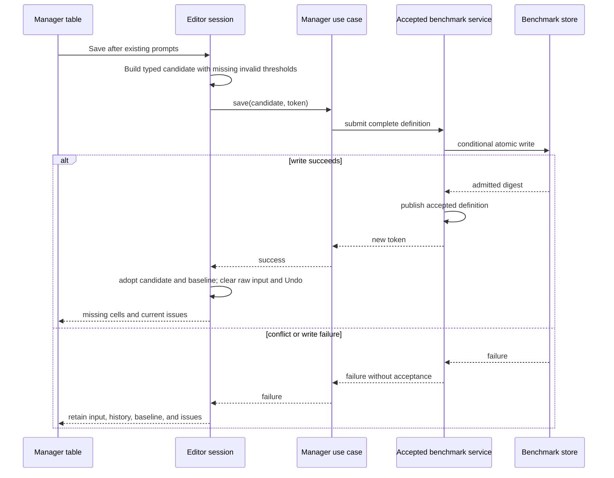

# Benchmark table editor design

## Purpose and design scope

This proposal designs the editing experience in the [benchmark table-editor requirements](requirements.md). It replaces the manager's scenario cards with a compact table, adds positional clipboard transfer and session Undo, and defines how invalid threshold input becomes a missing value on successful Save.

It preserves benchmark evaluation, stable identity, saved-file ownership, playlist seeding, scenario resolution, and the manager's historical-reinterpretation and unsaved-work safeguards. It does not implement the feature, define an implementation plan, introduce persistent malformed drafts, or change the benchmark JSON schema.

The developer confirmed the choices below for inclusion in this proposal. That confirmation authorizes document synthesis; the document remains proposed until explicitly accepted.

## Design basis

The implemented baseline is:

- [`BenchmarkManagerViewModel`](../../../../src/ui/presentation/benchmark_manager_vm.h) owns a typed working copy, accepted baseline, admitted edit token, dirty state, validation, and local structural edits. Its application boundary is `IBenchmarkManagerUseCase`; accepted-library publication does not replace the local working copy.
- [`BenchmarkManagerDialog.qml`](../../../../src/ui/qml/BenchmarkManagerDialog.qml) owns the manager's transition prompts, historical-reinterpretation warning, colour dialog, mapping controls, and card presentation. Its threshold fields currently combine `DoubleValidator` with JavaScript `parseFloat`.
- [`Benchmark`](../../../../src/domain/benchmarks/benchmark.h) stores ordered tiers and nested ordered scenario collections. Thresholds refer to stable tier IDs. A missing threshold is the absence of a corresponding threshold entry, not a score of zero.
- [`BenchmarkEditor`](../../../../src/domain/benchmarks/benchmark_editor.cpp) provides pure mutations over a caller-owned benchmark. Some existing commands need adaptation: repeated unnamed scenario creation is rejected as duplicate membership, and creating the first subcategory in a populated category currently moves its direct scenarios into another subcategory automatically.
- [`validateBenchmark`](../../../../src/domain/benchmarks/benchmark_validation.cpp) reports finite/non-negative and increasing-score rules, duplicate membership, empty groups, and mixed hierarchy. The current implementation does not check missing individual tier, scenario, or group names. Its threshold diagnostics address an entry rather than a specific entry/tier cell.
- [`BenchmarkManagerUseCase`](../../../../src/app/usecases/benchmark_manager_use_case.cpp) delegates complete working-copy saves. [`BenchmarksService`](../../../../src/data/benchmarks_service.cpp) publishes accepted data only after persistence succeeds; [`BenchmarkStore`](../../../../src/qt_data/benchmark_store.cpp) uses digest preconditions and atomic replacement. The codec requires numeric scores and represents missing thresholds by omission.
- Existing [manager view-model tests](../../../../tests/ui/benchmark_manager_vm_test.cpp) cover successful-save baselines and save-conflict preservation. [Manager Qt Quick tests](../../../../tests/ui/qml/tst_BenchmarkManagerDialog.qml) provide the presentation verification seam.

[ADR 0002](../../../architecture/decisions/0002-embedded-stable-identity-for-benchmark-elements.md) governs embedded element identity. [ADR 0004](../../../architecture/decisions/0004-route-view-model-interactions-through-use-cases.md) governs presentation's application boundary, and [ADR 0005](../../../architecture/decisions/0005-data-owned-benchmark-service-and-presentation-drafts.md) governs working-copy, accepted-library, store, and profile-join ownership. Application interfaces follow [ADR 0001](../../../architecture/decisions/0001-application-interface-and-implementation-placement.md).

The [Architecture Description](../../../architecture/README.md) and [parent benchmark design](../design.md) supplied architectural context. Parts of those documents describe an earlier baseline; current code and ADR 0005 establish this feature's ownership and edit-lease behavior. The graph was used at Tier 2 with targeted source verification. Coverage reported changed filesystem metadata and partial parsing in the manager header; that header and material source behavior were read directly. Graph tracing did not establish virtual-interface save calls, so their declarations and implementations supplied that evidence. No table-scale latency or Undo-memory measurements are available.

## Technical drivers

- Clipboard placement must preserve every cell's coordinates, including blanks and invalid input.
- Existing groups must remain adjacent, while separate name and threshold pastes must not reorder scenarios.
- Invalid text must survive editing, scrolling, regrouping, cancelled transitions, and failed saves without entering accepted benchmark data.
- Save must preserve the cell as a missing value, with an issue, rather than substitute a real score or expand persistent value types.
- Stable IDs must preserve thresholds, mappings, selection, and diagnostics when rows or ranks move.
- Large definitions need compact inspection and a bounded number of live visual delegates.
- Existing incomplete-save and historical-reinterpretation behavior must remain available.

## Proposed design and delta

Keep the manager view model as the editor-session owner. Extend its working state with temporary threshold-input records and a shared Undo history. Expose a flat table projection keyed by existing element IDs, with group-span metadata and editable rank headers. QML renders that projection and forwards commands; it does not own authoritative cell values or perform numeric conversion.

Categories appear in benchmark` `order, followed by Uncategorized. Within each category, scenarios follow their containing collection's explicit order, with subcategories in their explicit order. New rows created by paste append to Uncategorized at the end of the table. Grouping remains a deliberate manual operation over selected rows.

The accepted benchmark, application save boundary, and store format remain unchanged. The domain editor gains the structural operations needed for atomic expansion, ordered multi-row assignment, and explicit hierarchy repair. Domain validation gains missing-element-name checks and threshold-cell locations. These are behavior extensions; this document does not describe them as already implemented.

## Design elements and responsibilities

### Editor session

`BenchmarkManagerViewModel` remains the owner of:

- the typed `Benchmark`, accepted baseline, and current edit token;
- temporary input keyed by `(ScenarioEntryId, TierId)`;
- current cell and selected scenario IDs;
- shared edit history and the derived dirty state;
- combined input and domain issues, plus independently derived scenario-resolution state.

Presentation-only collaborators may encapsulate parsing, history, and table projection, but they do not become additional owners of the working definition. Application operations continue through `IBenchmarkManagerUseCase`. Clipboard access is a Qt presentation adapter invoked by a user paste command; the parsing and mutation path also accepts supplied text directly for tests.

### Table projection

A `QAbstractTableModel`-style adapter supplies body rows, threshold columns, display/edit roles, issue locations, and stable IDs. Rank headers supply tier IDs, names, colours, and issues. Category and subcategory cells supply group ID, span start, span length, name, colour, and issue state.

There are no extra scenario rows for group labels. Each non-empty group's span covers its adjacent scenario rows. Empty groups cannot occupy a scenario span, so compact group-management controls retain access to them and their validation issues. Uncategorized has a neutral label and no user-created group colour control.

The projection is derived from session state. It does not serialize, resolve profile identities, own history, or preserve a competing independent row order.

### Input parser and batch edit

The text parser produces a position-preserving cell matrix. A paste command resolves its destination against the current projection, allocates required rows and tiers, applies values to a candidate session state, and publishes one successful edit.

Domain mutations own structural meaning and ID preservation. Presentation handles clipboard syntax, numeric text, selection, and formatting. Rejected structural operations leave the whole session unchanged. Cell-level validation problems remain accepted editable input and do not reject a paste.

### Validation

The domain validator remains the authority for completeness of typed definitions. Extend it to identify missing tier, scenario, and user-created group names, and to attach a tier ID alongside an entry ID for threshold-specific issues. Keep benchmark/group issues at their natural scope; do not manufacture a cell location for a global issue.

Presentation adds input issues for non-numeric text and non-finite/unrepresentable numeric input. The combined issue projection distinguishes these from missing thresholds, negative scores, non-increasing scores, duplicate names, and hierarchy issues. An input issue takes precedence over the derived missing-value label at that cell so the retained source text remains understandable. Mapping status stays separate from definition completeness.

## Interfaces and interactions

### Opening and manual editing

Opening a saved definition creates a session from the existing editor seed and token. A new benchmark or successful playlist seed uses the same session path. Raw input and history start empty. Projection order is always derived from the hierarchy, with Uncategorized last.

Normal numeric cells show locale-generated thousands separators. Only the actively edited cell shows an ungrouped numeric edit string. The formatter must preserve the threshold's numeric precision; the existing rounded tracking-number formatter is not an edit-string source. Merely entering and leaving an unchanged cell must not round its score or dirty the benchmark.

Typing accepts ordinary grouped or ungrouped numbers under the application's active locale, including scientific notation. Parsing consumes the entire trimmed input and checks separator placement. It does not guess another locale, evaluate formulas, or accept a numeric prefix such as `12` from `12oops`. Qt's existing locale support is reused; automatic source-locale detection is deferred. Invalid input retains the supplied cell text rather than a reformatted substitute.

### Paste

1. Finish the current cell edit into session state, including invalid input, then capture the selected destination and clipboard text.
2. Decode tabs and line breaks, supporting ordinary spreadsheet quoting where delimiters occur inside a quoted cell. Preserve internal and trailing empty cells; discard only the empty record attributable to one routine terminal line break. Do not trim the entire block or collapse blank rows.
3. Resolve body destinations by the current scenario-row and tier-column order. A body block beginning at Scenario places names in that column and any following cells in threshold columns. A threshold block writes only threshold columns. Rank names paste horizontally into the rank-header row. Category/subcategory destinations do not accept paste; incompatible header shapes receive a placement explanation rather than silent transposition or truncation.
4. Append sufficient unnamed scenario entries to Uncategorized and sufficient unnamed tiers to the ladder. Generate IDs only for new elements and use ordinary default tier colours. Repeated unnamed rows are allowed as incomplete editing state; placeholders are presentation text only.
5. Apply the complete matrix to a candidate session. Blank thresholds remove their numeric entries. Finite parsed numbers become typed thresholds; input that cannot become a finite score remains in temporary cell state with no corresponding numeric threshold. Existing hash mappings remain unchanged when names are pasted.
6. Publish the candidate as one edit, recompute validation and resolution once, and update the affected projection. One Undo restores all overwritten values and input text and removes that paste's expansion.

Paste uses position, never name matching. It does not regroup existing scenarios. Rows created beyond the final visible row append at the final Uncategorized section, so the complete block stays in visible order. Changes outside the rectangle are limited to necessary expansion and the missing-name/threshold issues that expansion creates.

### Grouping, ordering, and mapping

Commands use selected scenario IDs rather than remembered row numbers. Multi-row assignment preserves their current relative order and places them in the target collection's defined order. Thresholds and raw input follow entry/tier IDs. Reordering ranks changes the ladder and increasing-score validation without retargeting scores.

Validate a complete group assignment before detaching any entry. Reject a target that would mix direct scenarios with subcategories, and explain how the user can arrange a valid hierarchy. Creating a first subcategory beneath direct scenarios requires an explicit choice of where those scenarios should go; do not invoke the existing automatic reorganization as an invisible side effect. Group removal retains the existing recovery of member scenarios to Uncategorized.

Group-name editing renames the group. Row assignment changes membership. These use distinct commands. Mapping details open for the selected scenario through contextual controls, retaining the current candidate selection, clearing, and historical warning behavior. Group and rank swatches open colour selection at their table location and commit only on acceptance.

### Save and transition recovery

Before Save, commit the active text edit into the session and retain all input warnings. The manager shows which invalid inputs will become missing thresholds if Save proceeds. Existing historical-reinterpretation and Save/Discard/Cancel prompts remain the authorization gates; no second compulsory repair flow is introduced.

Build an isolated typed candidate with every non-numeric, NaN, infinity, or otherwise non-finite input represented as a missing threshold. Submit that complete candidate and the existing token through the manager use case. Do not change the visible session while persistence is pending.

After success, use the normalized candidate as both working definition and baseline, adopt the returned token, and recompute issues and resolution. Invalid cells remain present and show missing thresholds. Clear session Undo only after success. A cancelled prompt performs no normalization; a failed save changes neither the stored benchmark nor the editor input or history.

Discard clears temporary input and history and follows the existing transition's accepted-state path. Reopening seeds from accepted data. Refresh or profile notifications can update library/resolution context and stale-token status without replacing local values or clearing history; Undo never rewinds accepted-library publication or profile state.

## Data, state, and persistence

### Threshold states

| Cell state                              | Session representation                                                  | Save representation | Visible result after successful Save/reopen            |
| --------------------------------------- | ----------------------------------------------------------------------- | ------------------- | ------------------------------------------------------ |
| Missing                                 | No numeric threshold and no temporary input                             | Missing threshold   | Missing cell with applicable issue                     |
| Finite score, including zero            | Typed numeric threshold                                                 | Same numeric score  | Formatted number; numeric-rule issues where applicable |
| Non-numeric text                        | Exact temporary text plus input issue; no numeric threshold             | Missing threshold   | Missing cell with issue                                |
| NaN, infinity, or non-finite conversion | Exact temporary text plus strong non-finite issue; no numeric threshold | Missing threshold   | Missing cell with issue                                |

“Missing/null” is a logical cell value. In the existing domain and JSON shape it is encoded by omitting that tier's threshold object. The saved scenario and tier still define the cell, and validation identifies the missing threshold. Do not write a null numeric `score`, substitute zero, remove the scenario or tier, or add a string-valued score/provenance field. Reopening intentionally cannot distinguish a formerly invalid input from another missing threshold.

Finite negative or non-increasing thresholds remain numeric values with completeness issues. Save normalization does not repair these, names, hierarchy, or mappings. The benchmark-name precondition and incomplete/invalid classifications remain in force. No schema bump or file migration is needed for this design.

### Undo and dirty state

Use one history for committed cell edits, paste, colours, names, ordering, grouping, and mapping changes. A paste or multi-row structural command is one entry. To undo a paste preceded by later edits, the user first undoes those later edits; an older snapshot must never overwrite subsequent work out of order.

History can initially store before/after snapshots of the typed working definition and temporary cell state, together with selection anchors needed for recovery. Baseline, accepted token, library state, and profile-derived resolution are not restored from history. Newly allocated IDs are retained in history snapshots, not regenerated during restoration. Derived spans and validation are recomputed after restoration.

Dirty comparison includes temporary input as well as differences from the accepted typed baseline. Entering invalid text into an already missing cell therefore counts as unsaved work. Selection, focus, and formatting-only changes do not. New/open/import/discard transitions and successful Save establish a new history boundary; failed or cancelled saves preserve the current history. Undo is session-local and does not undo a successful disk save.

## Failure and quality behavior

- **Atomic editing:** perform expansion and structural changes on a candidate before publishing. Cell content issues are retained; invalid destinations or incompatible structural commands return an explanation without partial edits.
- **Persistence recovery:** normalization is isolated until success. Existing digest checks, atomic writes, edit leases, and accepted-state publication retain their ownership. Late library callbacks cannot replace the candidate with an unnormalized local definition.
- **Responsiveness:** parse and validate once per command, index row/tier IDs for cell access, and use viewport-limited visual delegates. Group spans are projection metadata; merged-cell rendering must clip and scroll correctly when only part of a span is visible. Initial editor commands remain on the UI thread. Benchmark representative clipboard workloads and history growth before claiming responsiveness; no latency target or arbitrary truncation limit is asserted.
- **Inspection and accessibility:** pair selection outlines, missing-value indicators, and strong input-error markers with textual information. Keep invalid text readable in the cell, with nearby issue details. Keyboard navigation reaches editable cells, headers, swatches, and contextual actions; validation navigation scrolls to stable IDs and returns focus predictably. Commit text before Save or command execution even if ordinary editing-finished signals have not fired.
- **Compact layout:** retain a shared rank-header row and identifying columns during threshold inspection. Mapping and row/group management use contextual menus or a detail surface rather than permanent cards. Frozen panes, exact sizing, and the renderer's span technique remain implementation latitude subject to these outcomes.
- **Local-only input:** clipboard content is treated as values, never executable expressions or workbook instructions. The design introduces no network access, workbook-file parser, file watcher, or additional persistence location.

## Requirements traceability and verification

| Requirement concern                                        | Design response                                                                          | Credible verification                                                                                                                                                            |
| ---------------------------------------------------------- | ---------------------------------------------------------------------------------------- | -------------------------------------------------------------------------------------------------------------------------------------------------------------------------------- |
| Compact rows, shared headers, merged hierarchy and colours | Flat table projection, span metadata, contextual controls, acceptance-only colour commit | Projection tests and Qt Quick tests for spans, focus, labels, colour cancellation, and scrolled spans                                                                            |
| Positional threshold and separate name paste               | Matrix parser, ID-resolved destination, candidate batch mutation                         | Supplied-text tests for single/multiple columns, name/header passes, quoting, internal blanks, zero, terminal newline, and untouched neighbours                                  |
| Complete expansion and missing names                       | New stable IDs, Uncategorized-last rows, appended tiers, empty real names                | Expansion/Undo tests, missing-name validation, and save/reopen with placeholders absent from stored names                                                                        |
| Adjacent manual grouping and existing management           | Explicit ordered assignment, hierarchy preflight, unchanged entry IDs and hashes         | Domain and view-model tests for multi-row moves, conflicts, ordering, empty groups, group removal, and explicit first-subcategory choices                                        |
| Retained invalid text and repair                           | Temporary cell records, full-cell locale parsing, strong input issues                    | Parsing and cell-edit tests for grouped numbers, editing display, numeric-prefix rejection, non-finite text, correction, scrolling, and regrouping                               |
| Missing versus numeric errors and trackability             | Domain completeness extensions and input issue projection                                | Validator tests for missing/duplicate names, cell-specific missing/negative/non-increasing scores, and absent official results for incomplete definitions                        |
| One-step paste Undo and other edit recovery                | Shared session history and ID-based snapshots                                            | Interleaved paste/manual/group edits, expansion reversal, raw-text restoration, dirty comparison, and Save history boundaries                                                    |
| Invalid input saves as missing/null                        | Isolated typed candidate, omission of threshold entries, adoption only after success     | Real-store round trips containing non-numeric/NaN/infinity input and valid neighbours; inspect reopened missing values and incomplete classification                             |
| Save/Discard/Cancel, conflicts, and historical safeguards  | Existing prompts/use case/store token path; preserved state on failure                   | Qt Quick transition tests and view-model/integration tests for cancelled warnings, failed writes, stale tokens, active cell edits, discard, and no deferred action after failure |
| Playlist, mappings, library controls and sharing remain    | Existing seeds, application boundary, stable mappings, unchanged schema                  | Existing regression suites plus real composition tests for seed editing, mapping retention, successful publication, and reopening                                                |

UI behavior is verified with GoogleTest and Qt Quick Test rather than driving the running app. Integration verification uses the real wired object graph and deterministic managed paths. Use the supplied workbook's desired columns as representative clipboard values; no workbook import capability is implied. During implementation, use the repository build/test wrapper for focused checks and its complete default regression gate at the end. This document-only change does not claim those implementation tests have run.

## Architectural decisions

The design retains the accepted boundaries in ADRs 0001, 0002, 0004, and 0005: presentation owns temporary editing, application contracts coordinate accepted operations, the data service owns admitted definitions, and the store owns files. Existing IDs remain immutable through every table operation. There is no new accepted-state authority or persistent row-order field.

Developer-confirmed feature choices are hierarchy-adjacent rows with Uncategorized last; manual grouping without clipboard inference; generated separators in normal display with ungrouped active-cell editing; active-locale parsing; shared Undo cleared on successful Save; and missing/null persistence for non-numeric text, NaN, and infinity. The later NaN/infinity clarification supersedes the suggestion to block Save for those inputs.

**ADR recommendation:** None for this proposal. The changes reuse existing durable ownership, identity, and persistence decisions. Table-session input and Undo behavior are feature-local and remain self-contained here. A future persistent malformed-draft format or shared cross-feature editor authority would merit separate architectural consideration.

## Recommended realization slices

### 1. Compact table editing

**Observable outcome:** Users inspect and manually edit an existing benchmark in adjacent grouped rows with shared rank headers, inline colours, and accessible mapping/management actions.

**Design subset:** Table projection, hierarchy order, group spans, numeric display/edit distinction, missing-name and cell-location validation, explicit manual grouping, and preserved manager transitions.

**Intentional deferrals:** Clipboard batching and shared Undo. The completed feature requires both; this first increment does not claim full PRD acceptance.

**Dependencies:** Existing manager seed/save contracts, typed editor, and stable identities.

**Main uncertainty:** Rendering long merged spans and retaining keyboard/issue focus under viewport recycling.

**Completion evidence:** Native projection/`domain `checks and Qt Quick coverage for compact editing, scrolled groups, empty-group management, explicit hierarchy repair, mapping actions, and unchanged save warnings.

### 2. Recoverable paste and Undo

**Observable outcome:** Users transfer scenario names, rank names, and threshold blocks, retain invalid values for repair, expand the table, and reverse edits safely.

**Design subset:** Position-preserving parser, temporary input state, candidate batch edits, Uncategorized-last expansion, strict locale conversion, combined issues, and shared Undo/dirty comparison.

**Intentional deferrals:** Saving normalized invalid input remains the next increment's product boundary; ordinary typed saves retain their existing behavior.

**Dependencies:** Compact table editing and validation locations.

**Main uncertainty:** Representative paste/history costs and normal spreadsheet clipboard quoting behavior.

**Completion evidence:** Placement, expansion, invalid-input retention, grouped-number editing, and interleaved Undo checks using representative workbook-derived text and Qt Quick interactions. Measure command and history behavior without claiming an unmeasured improvement.

### 3. Save normalization and complete recovery

**Observable outcome:** A user deliberately saves imperfect threshold input as missing/null, sees its remaining issues, reopens the same incomplete definition, and recovers intact input after a failed or cancelled save.

**Design subset:** Isolated typed save candidate, successful baseline/input/history adoption, NaN/infinity normalization, existing transition safeguards, and real persistence round trips.

**Intentional deferrals:** Persistent Undo, malformed drafts, locale autodetection, workbook import, and grouping paste remain outside the feature.

**Dependencies:** Recoverable input state and existing conditional store acceptance.

**Main uncertainty:** Save callbacks and deferred transitions must preserve session state until success and then adopt exactly the persisted candidate.

**Completion evidence:** View-model/Qt Quick transition checks, real-store and composition coverage, and the full repository regression gate. The project owner can then perform the PRD's practical workbook comparison as product acceptance evidence.

## Risks, trade-offs, and implementation latitude

- Snapshot history is easy to reason about but uses memory proportional to edited definition size and history depth. Command deltas or shared snapshots are implementation latitude if Undo behavior and ID preservation remain identical; measurements must guide optimization.
- Deliberate regrouping moves rows, so subsequent positional paste needs a destination in the new visible order. The table must retain clear selection and move whole scenario state together.
- Saving invalid input loses its original text and reason. The visible missing cell and its issue remain; no persisted provenance distinguishes it from an originally blank threshold.
- Active-locale parsing accepts familiar grouped input but does not automatically resolve another locale's conventions. Unsupported or ambiguous text stays visible for correction rather than being guessed.
- Missing-element-name checks can classify previously loaded blank-name definitions as incomplete. Their files remain readable and repairable; their stored types and schema do not change.
- Long group spans, delegate recycling, empty-group access, and full-precision numeric edit strings need focused verification. The old card editor is not a fallback required by this design.
- Exact collaborator names, model roles, component allocation, selection gestures, menu/detail presentation, column dimensions, span renderer, and history storage strategy remain implementation latitude. They must preserve the ownership, paste, hierarchy, persistence, and recovery behavior specified above.

No material design blocker remains for this proposal. Acceptance of the written SDD and implementation are separate subsequent steps.
